<div class="container-lg clearfix border p-2 bg-blue-light my-">
  <div class="col-md-6 float-left p-2 border0">
    📧 <a href="mailto:pigrecoinfinito@gmail.com">Info!</a>
  </div>
  <div class="col-md-6 float-left p-2 border0 text-right">
    Thanks to the precious help of <a class="" href="https://twitter.com/aborruso" target="_blank"><b>Andrea Borruso</b></a>
  </div>
</div>

<br>

[**Pigrecoinfinito**](http://pigrecoinfinito.com/) has collected on this page some **views** of the changelog 3.14 Pi 😊.

The following changelogs are the result of this [filter](https://github.com/qgis/QGIS/pulls?page=1&q=is%3Apr+is%3Aclosed+label%3Afeature+merged%3A2020-02-22T00%3A00%3A00Z..2020-05-15T12%3A00%3A00Z):

```
is:pr is:closed label:feature merged:2020-02-22T00:00:00Z..2020-05-15T12:00:00Z
```

- **Release date freeze** : 15 May,2020
- **Release date packaging**: 19 June, 2020
- **Release date**: 22 June, 2020

---

- **QGIS**: <https://qgis.org/it/site/>
- **Repository**: <https://github.com/qgis/QGIS>

---

- **Tweet QGIS 3.14 Pi**: <https://twitter.com/totofiandaca/status/1244960239193120771>


<hr>

- **Chair** : [Marco Bernasocchi](https://io.berna.io/)
- **Vice-Chair** : [Alessandro Pasotti](https://www.itopen.it/)

- [**honorary PSC members**](http://blog.qgis.org/2020/05/06/qgis-annual-general-meeting-2020/): Gary Sherman, Tim Sutton

- [**honorary QGIS members**](https://www.qgis.org/en/site/getinvolved/governance/charter/index.html#honorable-members): Harrissou Sant-anna, Nyall Dawson

<hr>

<div class="flash flash-error">
  <h2><p align="center"><b>UPDATED 2020-05-15T12:00:00Z - 131 features</b></p></h2>
</div>

<br>
 
<!-- TOC -->

- [Features](#features)
  - [Add ability to export animation frames](#add-ability-to-export-animation-frames)
  - [Add additional temporal modes for vector layers](#add-additional-temporal-modes-for-vector-layers)
  - [use only specified dataset group](#use-only-specified-dataset-group)
  - [New variables @animation_start_time and @animation_end_time](#new-variables-animationstarttime-and-animationendtime)
  - [scalar color settings depending on classification](#scalar-color-settings-depending-on-classification)
  - [Add cumulative temporal range setting in temporal controller](#add-cumulative-temporal-range-setting-in-temporal-controller)
  - [Expose temporal UI for map items](#expose-temporal-ui-for-map-items)
  - [allow adding attributes in the New Scratch Layer dialog (fix #24397)](#allow-adding-attributes-in-the-new-scratch-layer-dialog-fix-24397)
  - [Respect HTML colors in labels](#respect-html-colors-in-labels)
  - [add Selection toolbar to the QGIS main window](#add-selection-toolbar-to-the-qgis-main-window)
  - [Determine primary key from Oracle view](#determine-primary-key-from-oracle-view)
  - [New expression function make_interval](#new-expression-function-makeinterval)
  - [Add expression variables for frame properties](#add-expression-variables-for-frame-properties)
  - [Add a new Redraw Layer Only mode for temporal vector layers](#add-a-new-redraw-layer-only-mode-for-temporal-vector-layers)
  - [Add make_date, make_time and make_datetime functions](#add-makedate-maketime-and-makedatetime-functions)
  - [Add basic temporal handling support for vector layers](#add-basic-temporal-handling-support-for-vector-layers)
  - [allow sorting attribute table by field not listed in the table](#allow-sorting-attribute-table-by-field-not-listed-in-the-table)
  - [Allow customisation of division and subdivision symbols as distinct from scalebar tick horizontal symbol](#allow-customisation-of-division-and-subdivision-symbols-as-distinct-from-scalebar-tick-horizontal-symbol)
  - [allow creating geometryless DBF tables from the New Shapefile dialog (fix #15654)](#allow-creating-geometryless-dbf-tables-from-the-new-shapefile-dialog-fix-15654)
  - [Vector tile layer - part 8 (writer in Processing)](#vector-tile-layer---part-8-writer-in-processing)
  - [allow to drag'n'drop layer across several QGIS instances](#allow-to-dragndrop-layer-across-several-qgis-instances)
  - [enhance sorting capabilities in attribute table list/form view](#enhance-sorting-capabilities-in-attribute-table-listform-view)
  - [Expose control over layer legend splitting behavior on a layer-by-layer basis](#expose-control-over-layer-legend-splitting-behavior-on-a-layer-by-layer-basis)
  - [allow editing of links in file widget](#allow-editing-of-links-in-file-widget)
  - [Snap on mesh elements](#snap-on-mesh-elements)
  - [Allow filtering WM(T)S list in source dialog](#allow-filtering-wmts-list-in-source-dialog)
  - [Allow overriding the default symbol for a legend node](#allow-overriding-the-default-symbol-for-a-legend-node)
  - [Allow placing manual column breaks in legends](#allow-placing-manual-column-breaks-in-legends)
  - [Add subdivisions in ticksscalebar right segments](#add-subdivisions-in-ticksscalebar-right-segments)
  - [Complete random raster algorithm collection #2](#complete-random-raster-algorithm-collection-2)
  - [Automatic placement of labels outside polygons](#automatic-placement-of-labels-outside-polygons)
  - [Feature browser for preview in expression builder](#feature-browser-for-preview-in-expression-builder)
  - [add expression close_line](#add-expression-closeline)
  - [Allow overriding the legend patch size on a per-item basis](#allow-overriding-the-legend-patch-size-on-a-per-item-basis)
  - [Allow control over the horizontal spacing before legend group/subgroup/symbols](#allow-control-over-the-horizontal-spacing-before-legend-groupsubgroupsymbols)
  - [Support for adding dock widgets as tabs](#support-for-adding-dock-widgets-as-tabs)
  - [Expressions for geometry Z and M minimum and maximum](#expressions-for-geometry-z-and-m-minimum-and-maximum)
  - [1D mesh width/color varying](#1d-mesh-widthcolor-varying)
  - [Manage legend patch shapes through style manager](#manage-legend-patch-shapes-through-style-manager)
  - [ability to remove custom functions (fix #27513)](#ability-to-remove-custom-functions-fix-27513)
  - [add is_multipart expression for geometry](#add-ismultipart-expression-for-geometry)
  - [Allow configuring legend patch shapes by double-clicking on legend items](#allow-configuring-legend-patch-shapes-by-double-clicking-on-legend-items)
  - [ascii expression](#ascii-expression)
  - [Support pasting pictures directly into layouts](#support-pasting-pictures-directly-into-layouts)
  - [Add vector tiles to Datasource manager dialog and Layers menu](#add-vector-tiles-to-datasource-manager-dialog-and-layers-menu)
  - [New modeler algorithm for creating conditional branches](#new-modeler-algorithm-for-creating-conditional-branches)
  - [import/export for ArcGIS Map and FeatureServer connections](#importexport-for-arcgis-map-and-featureserver-connections)
  - [Allow reordering model inputs](#allow-reordering-model-inputs)
  - [Add XYZ tiles to Datasource manager dialog and Layers menu](#add-xyz-tiles-to-datasource-manager-dialog-and-layers-menu)
  - [Defer model validation](#defer-model-validation)
  - [Vector tile layer - part 5 (identify tool)](#vector-tile-layer---part-5-identify-tool)
  - [Server: add QGIS_SERVER_IGNORE_BAD_LAYERS config option](#server-add-qgisserverignorebadlayers-config-option)
  - [Add support for different raster data types in Create constant raster layer algorithm](#add-support-for-different-raster-data-types-in-create-constant-raster-layer-algorithm)
  - [add native Round raster algorithm](#add-native-round-raster-algorithm)
  - [Add avoid intersection/overlap mode](#add-avoid-intersectionoverlap-mode)
  - [Forms: expression controlled aliases (labels)](#forms-expression-controlled-aliases-labels)
  - [Vector tile layer - part 4 (labeling)](#vector-tile-layer---part-4-labeling)
  - [Allow copying/cut/paste of model components](#allow-copyingcutpaste-of-model-components)
  - [Allow appending processing results to existing layers](#allow-appending-processing-results-to-existing-layers)
  - [Allow plugins to register custom Project Open handlers](#allow-plugins-to-register-custom-project-open-handlers)
  - [Allow marker items to sync rotation with maps](#allow-marker-items-to-sync-rotation-with-maps)
  - [New item type for marker symbols](#new-item-type-for-marker-symbols)
  - [Expression builder add layer_property](#expression-builder-add-layerproperty)
  - [Added move to bottom in layertreeview context menu](#added-move-to-bottom-in-layertreeview-context-menu)
  - [Show a menu next to scale widget buttons, to allow setting the widget directly to a scale from a print layout map](#show-a-menu-next-to-scale-widget-buttons-to-allow-setting-the-widget-directly-to-a-scale-from-a-print-layout-map)
  - [Postgres raster temporal API support](#postgres-raster-temporal-api-support)
  - [Allow creation of group boxes in models](#allow-creation-of-group-boxes-in-models)
  - [Spatialite provider transactions](#spatialite-provider-transactions)
  - [Port output parameter wrappers to new API](#port-output-parameter-wrappers-to-new-api)
  - [Add import content from clipboard for fixed table items](#add-import-content-from-clipboard-for-fixed-table-items)
  - [Processing: show input and output values for children after running model through designer](#processing-show-input-and-output-values-for-children-after-running-model-through-designer)
  - [Add Save Log to File algorithm for models](#add-save-log-to-file-algorithm-for-models)
  - [plug mesh layer to QGIS temporal framework](#plug-mesh-layer-to-qgis-temporal-framework)
  - [Network logger - more functionality](#network-logger---more-functionality)
  - [Port last remaining input parameters to new API](#port-last-remaining-input-parameters-to-new-api)
  - [Raster Layer Contour Renderer](#raster-layer-contour-renderer)
  - [Add percentage size unit for Raster Image Marker and Raster fill layers symbology.](#add-percentage-size-unit-for-raster-image-marker-and-raster-fill-layers-symbology)
  - [Port Feature Source, Raster, Vector and Mesh Layer parameters to new API](#port-feature-source-raster-vector-and-mesh-layer-parameters-to-new-api)
  - [Server project settings, add 'expanded' attribute](#server-project-settings-add-expanded-attribute)
  - [Inbuilt network logging tool](#inbuilt-network-logging-tool)
  - [Allowing saving outputs direct to more database formats (and other nice stuff)](#allowing-saving-outputs-direct-to-more-database-formats-and-other-nice-stuff)
  - [Vector tile layer - part 1](#vector-tile-layer---part-1)
  - [Allow running algorithms directly on database (and other non-disk) sources without loading into projects first](#allow-running-algorithms-directly-on-database-and-other-non-disk-sources-without-loading-into-projects-first)
  - [Port processing extent parameter to new api, many other improvements](#port-processing-extent-parameter-to-new-api-many-other-improvements)
  - [Interface and API for unified development/debugging tools](#interface-and-api-for-unified-developmentdebugging-tools)
  - [Expose per-feature-source advanced options for processing inputs](#expose-per-feature-source-advanced-options-for-processing-inputs)
  - [Resampling from vertex values to face values](#resampling-from-vertex-values-to-face-values)
  - [Enable snapping to grid for models in designer](#enable-snapping-to-grid-for-models-in-designer)
  - [Add numeric formatter fraction style](#add-numeric-formatter-fraction-style)
  - [Add stepped line and hollow scalebar styles](#add-stepped-line-and-hollow-scalebar-styles)
  - [Allow scalebar line style to be set using standard QGIS line symbols](#allow-scalebar-line-style-to-be-set-using-standard-qgis-line-symbols)
  - [Add data-defined property to font family/style for font markers](#add-data-defined-property-to-font-familystyle-for-font-markers)
  - [coloring mesh vector dataset with color ramp shader](#coloring-mesh-vector-dataset-with-color-ramp-shader)
  - [add maptip, expression display and eval_template expressions](#add-maptip-expression-display-and-evaltemplate-expressions)
  - [Add @layers, @layer_ids project scope variables](#add-layers-layerids-project-scope-variables)
  - [Add a font style setting for font markers](#add-a-font-style-setting-for-font-markers)
  - [Rework picture item UI and behavior](#rework-picture-item-ui-and-behavior)
  - [Add filter by geometry type and filter by layer type algorithms to processing](#add-filter-by-geometry-type-and-filter-by-layer-type-algorithms-to-processing)
  - [Add ability to edit, import and export user expressions](#add-ability-to-edit-import-and-export-user-expressions)
  - [Make Add Group button act as Group Selected if selected layers >= 2](#make-add-group-button-act-as-group-selected-if-selected-layers--2)
  - [Optionally, also remove EMPTY geometries in RemoveNullGeometries algorithm](#optionally-also-remove-empty-geometries-in-removenullgeometries-algorithm)
  - [Data type support for QgsProcessingParameterMapLayer](#data-type-support-for-qgsprocessingparametermaplayer)
  - [Add processing parameter types for database schema and table name](#add-processing-parameter-types-for-database-schema-and-table-name)
  - [Add description to value relation widget](#add-description-to-value-relation-widget)
  - [Add multi-selection handling to model designer, interactive resizing](#add-multi-selection-handling-to-model-designer-interactive-resizing)
  - [New database table name widget](#new-database-table-name-widget)
  - [Add dedicated parameter type for database connections](#add-dedicated-parameter-type-for-database-connections)
  - [arrows for 3D mesh layer dataset rendering](#arrows-for-3d-mesh-layer-dataset-rendering)
  - [Add undo/redo support to model designer](#add-undoredo-support-to-model-designer)
  - [Add control over anchor point for callout on label](#add-control-over-anchor-point-for-callout-on-label)
  - [PG expose foreign tables](#pg-expose-foreign-tables)
  - [Add expression variables for current map temporal range](#add-expression-variables-for-current-map-temporal-range)
  - [Remember parameter values between model designer runs](#remember-parameter-values-between-model-designer-runs)
  - [Plugin manager allow to install stable or experimental](#plugin-manager-allow-to-install-stable-or-experimental)
  - [PG raster expose set filter to app](#pg-raster-expose-set-filter-to-app)
  - [Comments in Processing Models](#comments-in-processing-models)
  - [Mesh 1D Renderer](#mesh-1d-renderer)
  - [Get current parent form values in child forms](#get-current-parent-form-values-in-child-forms)
  - [Relation wdgt: add checkbox to hide save child edits button](#relation-wdgt-add-checkbox-to-hide-save-child-edits-button)
  - [Relation widget force suppress popup](#relation-widget-force-suppress-popup)
  - [New standalone console tool for running processing algorithms](#new-standalone-console-tool-for-running-processing-algorithms)
  - [New parameter type for Merged (or date, or time) values](#new-parameter-type-for-merged-or-date-or-time-values)
  - [QGIS Project temporal settings](#qgis-project-temporal-settings)
  - [Make CRS controlable by a variable](#make-crs-controlable-by-a-variable)
  - [Mesh simplification](#mesh-simplification)
  - [WMS-T layers temporal constrains support](#wms-t-layers-temporal-constrains-support)
  - [Temporal API](#temporal-api)
  - [New snapping modes: Centroid and middle of a segment (midpoint)](#new-snapping-modes-centroid-and-middle-of-a-segment-midpoint)
  - [Show 'template layer' constraints info in the Refactor fields algorithm's UI](#show-template-layer-constraints-info-in-the-refactor-fields-algorithms-ui)
- [Statistics](#statistics)
  - [Authors](#authors)
  - [Tags](#tags)
  - [Sponsors](#sponsors)

<!-- /TOC -->

# Features

## Add ability to export animation frames
- **Author:** [nyalldawson](https://github.com/nyalldawson)
- **Milestone:** 3.14.0
- **PR:** [36453](https://github.com/qgis/QGIS/pull/36453)
- **Merged:** 2020-05-15T06:10:54Z
- **tags:** Temporal

[↑ come back ↑](#features)

## Add additional temporal modes for vector layers
- **Author:** [nyalldawson](https://github.com/nyalldawson)
- **Milestone:** 3.14.0
- **PR:** [36367](https://github.com/qgis/QGIS/pull/36367)
- **Merged:** 2020-05-13T10:20:01Z
- **tags:** Temporal

[↑ come back ↑](#features)

## use only specified dataset group
- **Author:** [vcloarec](https://github.com/vcloarec)
- **Milestone:** 3.14.0
- **PR:** [36334](https://github.com/qgis/QGIS/pull/36334)
- **Merged:** 2020-05-14T07:56:48Z
- **tags:** Mesh


[↑ come back ↑](#features)

## New variables @animation_start_time and @animation_end_time
- **Author:** [nyalldawson](https://github.com/nyalldawson)
- **Milestone:** 3.14.0
- **PR:** [36324](https://github.com/qgis/QGIS/pull/36324)
- **Merged:** 2020-05-10T09:33:35Z
- **tags:** Expressions; Temporal

[↑ come back ↑](#features)

## scalar color settings depending on classification
- **Author:** [vcloarec](https://github.com/vcloarec)
- **Milestone:** 3.14.0
- **PR:** [36313](https://github.com/qgis/QGIS/pull/36313)
- **Merged:** 2020-05-11T05:19:23Z
- **tags:** Mesh


[↑ come back ↑](#features)

## Add cumulative temporal range setting in temporal controller
- **Author:** [Samweli](https://github.com/Samweli)
- **Milestone:** 3.14.0
- **PR:** [36309](https://github.com/qgis/QGIS/pull/36309)
- **Merged:** 2020-05-10T23:00:25Z
- **tags:** Temporal


[↑ come back ↑](#features)

## Expose temporal UI for map items
- **Author:** [nirvn](https://github.com/nirvn)
- **Milestone:** 3.14.0
- **PR:** [36304](https://github.com/qgis/QGIS/pull/36304)
- **Merged:** 2020-05-10T07:30:08Z
- **tags:** Print Layouts; Temporal


[↑ come back ↑](#features)

## allow adding attributes in the New Scratch Layer dialog (fix #24397)
- **Author:** [alexbruy](https://github.com/alexbruy)
- **Milestone:** 3.14.0
- **PR:** [36289](https://github.com/qgis/QGIS/pull/36289)
- **Merged:** 2020-05-12T05:39:13Z
- **tags:**	-


[↑ come back ↑](#features)

## Respect HTML colors in labels
- **Author:** [nyalldawson](https://github.com/nyalldawson)
- **Milestone:** 3.14.0
- **PR:** [36283](https://github.com/qgis/QGIS/pull/36283)
- **Merged:** 2020-05-12T11:16:57Z
- **tags:**	-
- **Sponsored by** geoProRegio AG ([www.geoproregio.ch](http://www.geoproregio.ch/))


[↑ come back ↑](#features)

## add Selection toolbar to the QGIS main window
- **Author:** [alexbruy](https://github.com/alexbruy)
- **Milestone:** 3.14.0
- **PR:** [36258](https://github.com/qgis/QGIS/pull/36258)
- **Merged:** 2020-05-13T00:18:48Z
- **tags:** GUI/UX

[↑ come back ↑](#features)

## Determine primary key from Oracle view
- **Author:** [troopa81](https://github.com/troopa81)
- **Milestone:** 3.14.0
- **PR:** [35112](https://github.com/qgis/QGIS/pull/35112)
- **Merged:** 2020-05-13T13:29:04Z
- **tags:** Data Provider

[↑ come back ↑](#features)

## New expression function make_interval
- **Author:** [nyalldawson](https://github.com/nyalldawson)
- **Milestone:**	3.14.0
- **PR:** [36303](https://github.com/qgis/QGIS/pull/36303)
- **Merged:** 2020-05-09T10:22:54Z
- **tags:** Expressions

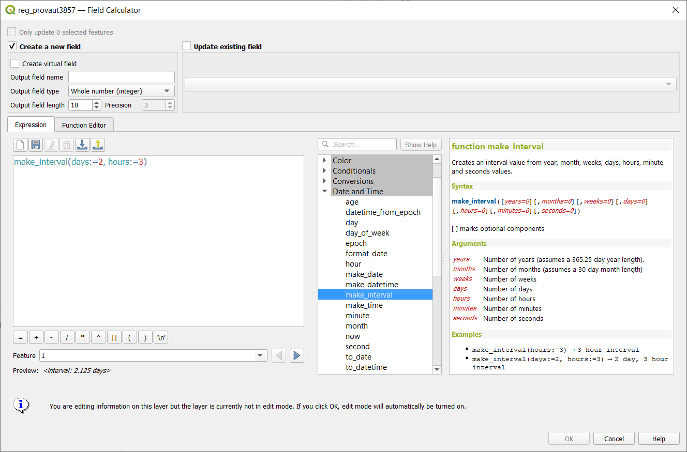

[↑ come back ↑](#features)

## Add expression variables for frame properties
- **Author:** [nyalldawson](https://github.com/nyalldawson)
- **Milestone:**	3.14.0
- **PR:** [36300](https://github.com/qgis/QGIS/pull/36300)
- **Merged:** 2020-05-09T08:07:00Z
- **tags:** Temporal

[↑ come back ↑](#features)

## Add a new Redraw Layer Only mode for temporal vector layers
- **Author:** [nyalldawson](https://github.com/nyalldawson)
- **Milestone:**	3.14.0
- **PR:** [36299](https://github.com/qgis/QGIS/pull/36299)
- **Merged:** 2020-05-09T08:06:37Z
- **tags:** Temporal

[↑ come back ↑](#features)

## Add make_date, make_time and make_datetime functions
- **Author:** [nyalldawson](https://github.com/nyalldawson)
- **Milestone:**	3.14.0
- **PR:** [36245](https://github.com/qgis/QGIS/pull/36245)
- **Merged:** 2020-05-07T04:46:55Z
- **tags:** Expressions

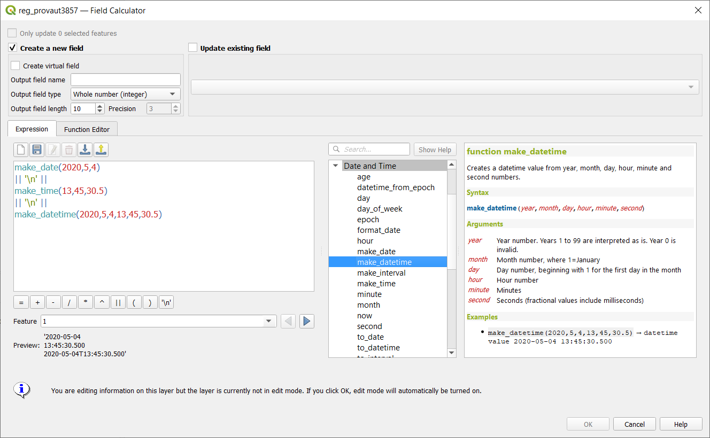

[↑ come back ↑](#features)

## Add basic temporal handling support for vector layers
- **Author:** [nyalldawson](https://github.com/nyalldawson)
- **Milestone:**	3.14.0
- **PR:** [36243](https://github.com/qgis/QGIS/pull/36243)
- **Merged:** 2020-05-08T01:46:T47Z
- **tags:** Temporal

[↑ come back ↑](#features)


##  allow sorting attribute table by field not listed in the table
- **Author:** [3nids](https://github.com/3nids)
- **Milestone:**	3.14.0
- **PR:** [36236](https://github.com/qgis/QGIS/pull/36236)
- **Merged:** 2020-05-07T04:02:T42Z
- **tags:** Print Layouts

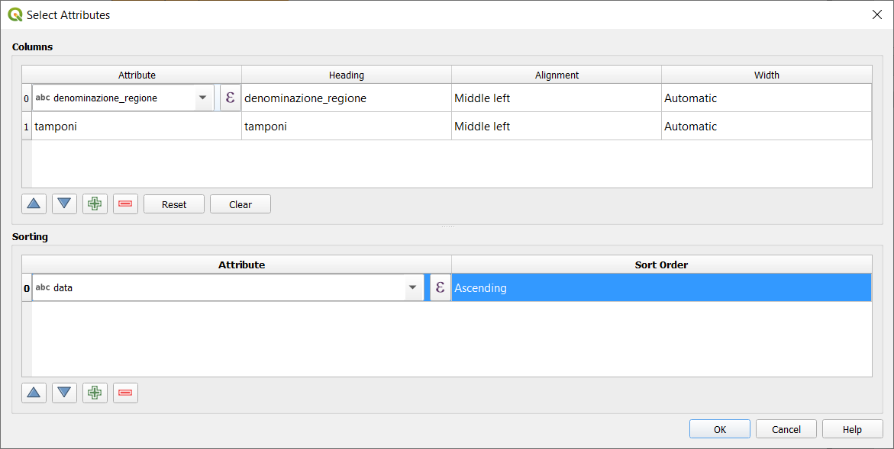

[↑ come back ↑](#features)

## Allow customisation of division and subdivision symbols as distinct from scalebar tick horizontal symbol
- **Author:** [nyalldawson](https://github.com/nyalldawson)
- **Milestone:**	3.14.0
- **PR:** [36222](https://github.com/qgis/QGIS/pull/36222)
- **Merged:** 2020-05-07T00:56:51Z
- **tags:** Print Layouts
- **Sponsored by:** SLYR

[↑ come back ↑](#features)

## allow creating geometryless DBF tables from the New Shapefile dialog (fix #15654)
- **Author:** [alexbruy](https://github.com/alexbruy)
- **Milestone:**	3.14.0
- **PR:** [36202](https://github.com/qgis/QGIS/pull/36202)
- **Merged:** 2020-05-06T10:30:T51Z
- **tags:** Vectors

[↑ come back ↑](#features)


## Vector tile layer - part 8 (writer in Processing)
- **Author:** [wonder-sk](https://github.com/wonder-sk)
- **Milestone:**	3.14.0
- **PR:** [36099](https://github.com/qgis/QGIS/pull/36099)
- **Merged:** 2020-05-08T10:55:T10Z
- **tags:** Vector tiles
- **Donors:** <https://www.lutraconsulting.co.uk/blog/2020/04/02/vectortiles-donors/>

[↑ come back ↑](#features)


## allow to drag'n'drop layer across several QGIS instances
- **Author:** [3nids](https://github.com/3nids)
- **Milestone:**	3.14.0
- **PR:** [35382](https://github.com/qgis/QGIS/pull/35382)
- **Merged:** 2020-05-06T14:04:T08Z
- **tags:** -
- **Sponsored by:** the QGIS Swiss user group


[↑ come back ↑](#features)

## enhance sorting capabilities in attribute table list/form view
- **Author:** [3nids](https://github.com/3nids)
- **Milestone:**	3.14.0
- **PR:** [36199](https://github.com/qgis/QGIS/pull/36199)
- **Merged:** 2020-05-06T06:45:T08Z
- **tags:** GUI/UX
- **Sponsored by:** the QGIS Swiss user group


[↑ come back ↑](#features)

## Expose control over layer legend splitting behavior on a layer-by-layer basis
- **Author:**	[nyalldawson](https://twitter.com/nyalldawson)
- **Milestone:** 3.14.0
- **PR:** [36224](https://github.com/qgis/QGIS/pull/36224)
- **Merged:**	2020-05-06T06:27:33Z
- **tags:**	Print Layouts
- **Sponsored by:** SLYR

[↑ come back ↑](#features)

## allow editing of links in file widget
- **Author:**	3nids
- **Milestone:** 3.14.0
- **PR:** [36190](https://github.com/qgis/QGIS/pull/36190)
- **Merged:**	2020-05-06T04:46:55Z
- **tags:**	Forms
- **Sponsored by:** the QGIS Swiss user group


[↑ come back ↑](#features)

## Snap on mesh elements
- **Author:**	vcloarec
- **Milestone:** 3.14.0
- **PR:** [36171](https://github.com/qgis/QGIS/pull/36171)
- **Merged:**	2020-05-05T11:31:50Z
- **tags:**	API; Mesh

[↑ come back ↑](#features)

## Allow filtering WM(T)S list in source dialog
- **Author:**	3nids
- **Milestone:** 3.14.0
- **PR:** [36166](https://github.com/qgis/QGIS/pull/36166)
- **Merged:**	2020-05-05T05:21:00Z
- **tags:**	GUI/UX
- **Sponsored by:** the QGIS Swiss user group


[↑ come back ↑](#features)

## Allow overriding the default symbol for a legend node
- **Author:**	[nyalldawson](https://twitter.com/nyalldawson)
- **Milestone:** 3.14.0
- **PR:** [36162](https://github.com/qgis/QGIS/pull/36162)
- **Merged:**	2020-05-05T01:49:07Z
- **tags:**	Print Layouts

[↑ come back ↑](#features)

## Allow placing manual column breaks in legends
- **Author:**	[nyalldawson](https://twitter.com/nyalldawson)
- **Milestone:** 3.14.0
- **PR:** [36136](https://github.com/qgis/QGIS/pull/36136)
- **Merged:**	2020-05-05T14:22:28Z
- **tags:**	-

[↑ come back ↑](#features)

## Add subdivisions in ticksscalebar right segments
- **Author:**	agiudiceandrea
- **Milestone:** 3.14.0
- **PR:** [36131](https://github.com/qgis/QGIS/pull/36131)
- **Merged:**	2020-05-05T23:12:37Z
- **tags:**	Print Layouts

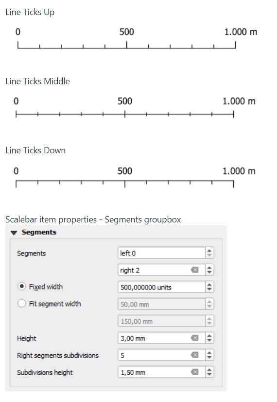

[↑ come back ↑](#features)

## Complete random raster algorithm collection #2
- **Author:**	[root676](https://github.com/root676)
- **Milestone:** 3.14.0
- **PR:** [36130](https://github.com/qgis/QGIS/pull/36130)
- **Merged:**	2020-05-03T20:28:46Z
- **tags:**	Processing

[↑ come back ↑](#features)
  
## Automatic placement of labels outside polygons
- **Author:** [nyalldawson](https://github.com/nyalldawson)
- **milestone:** 3.14.0
- **PR:** [36106](https://github.com/qgis/QGIS/pull/36106)
- **Merged:** 2020-05-03T19:38:49Z
- **tags:** Labeling
- **Sponsored by:** the Swiss QGIS user group


[↑ come back ↑](#features)

## Feature browser for preview in expression builder
- **Author:** [3nids](https://github.com/3nids)
- **milestone:** 3.14.0
- **PR:** [36089](https://github.com/qgis/QGIS/pull/36089)
- **Merged:** 2020-04-30T15:50:11Z
- **tags:** GUI/UX
- **Sponsored by:** the QGIS Swiss User Group!


[↑ come back ↑](#features)

## add expression close_line
- **Author:** [JanCaha](https://github.com/JanCaha)
- **milestone:** 3.14.0
- **PR:** [36069](https://github.com/qgis/QGIS/pull/36069)
- **Merged:** 2020-05-01T23:08:36Z
- **tags:** Expressions

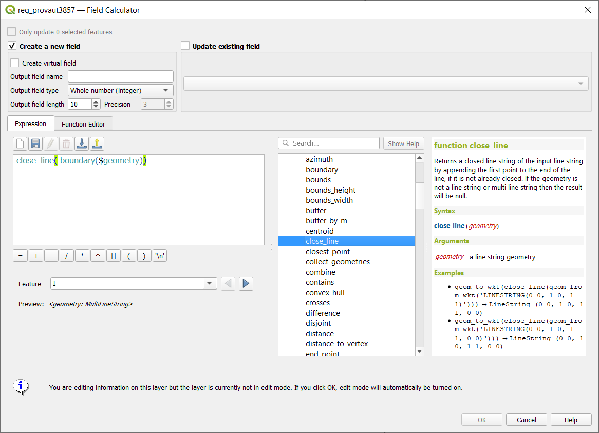

[↑ come back ↑](#features)

## Allow overriding the legend patch size on a per-item basis
- **Author:** [nyalldawson](https://github.com/nyalldawson)
- **milestone:** 3.14.0
- **PR:** [36013](https://github.com/qgis/QGIS/pull/36013)
- **Merged:** 2020-04-28T01:31:45Z
- **tags:** Print Layouts
- **Sponsored by:** SLYR


[↑ come back ↑](#features)

## Allow control over the horizontal spacing before legend group/subgroup/symbols
- **Author:** [nyalldawson](https://github.com/nyalldawson)
- **milestone:** 3.14.0
- **PR:** [35974](https://github.com/qgis/QGIS/pull/35974)
- **Merged:** 2020-04-24T18:49:55Z
- **tags:** Print Layouts
- **Sponsored by:** SLYR

[↑ come back ↑](#features)

## Support for adding dock widgets as tabs
- **Author:** [gacarrillor](https://github.com/gacarrillor)
- **milestone:** 3.14.0
- **PR:** [35933](https://github.com/qgis/QGIS/pull/35933)
- **Merged:** 2020-05-03T07:34:55Z
- **tags:** GUI/UX


[↑ come back ↑](#features)

## Expressions for geometry Z and M minimum and maximum
- **Author:** [JanCaha](https://github.com/JanCaha)
- **milestone:** 3.14.0
- **PR:** [35928](https://github.com/qgis/QGIS/pull/35928)
- **Merged:** 2020-04-27T11:28:23Z
- **tags:** Expressions

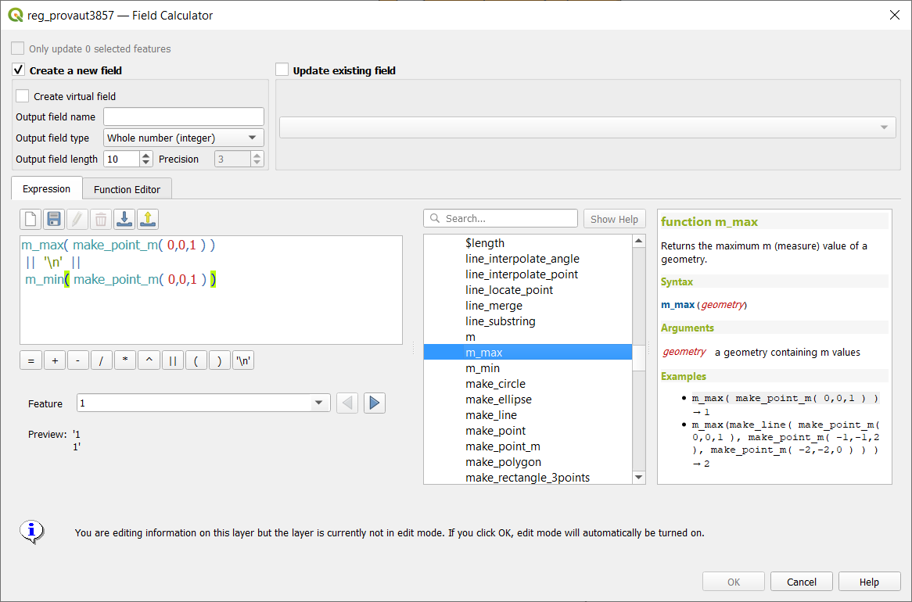

[↑ come back ↑](#features)

## 1D mesh width/color varying
- **Author:** [vcloarec](https://github.com/vcloarec)
- **milestone:** 3.14.0
- **PR:** [35926](https://github.com/qgis/QGIS/pull/35926)
- **Merged:** 2020-04-24T08:49:25Z
- **tags:** Documentation;Mesh


[↑ come back ↑](#features)

## Manage legend patch shapes through style manager
- **Author:** [nyalldawson](https://github.com/nyalldawson)
- **milestone:** 3.14.0
- **PR:** [35909](https://github.com/qgis/QGIS/pull/35909)
- **Merged:** 2020-04-22T02:43:03Z
- **tags:** Map and Legend


[↑ come back ↑](#features)

## ability to remove custom functions (fix #27513)
- **Author:** [alexbruy](https://github.com/alexbruy)
- **milestone:** 3.14.0
- **PR:** [35901](https://github.com/qgis/QGIS/pull/35901)
- **Merged:** 2020-04-30T06:38:40Z
- **tags:** GUI/UX

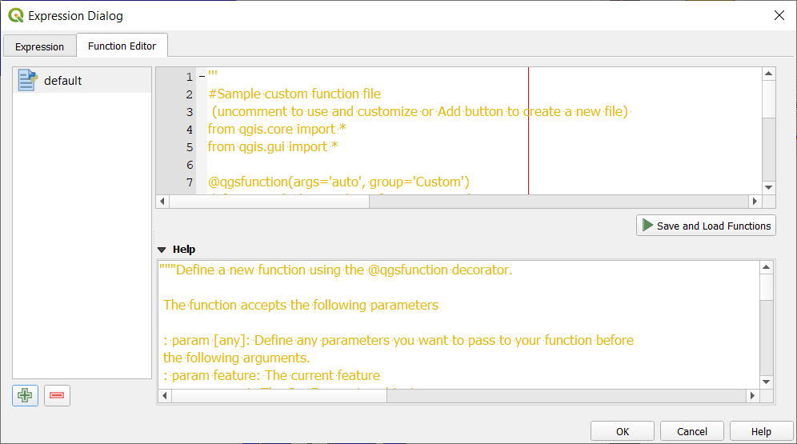

[↑ come back ↑](#features)

## add is_multipart expression for geometry
- **Author:** [JanCaha](https://github.com/JanCaha)
- **milestone:** 3.14.0
- **PR:** [35889](https://github.com/qgis/QGIS/pull/35889)
- **Merged:** 2020-04-21T19:26:55Z
- **tags:** Expressions


[↑ come back ↑](#features)

## Allow configuring legend patch shapes by double-clicking on legend items
- **Author:** [nyalldawson](https://github.com/nyalldawson)
- **milestone:** 3.14.0
- **PR:** [35863](https://github.com/qgis/QGIS/pull/35863)
- **Merged:** 2020-04-21T00:40:51Z
- **tags:** Print Layouts
- **Sponsored by:** SLYR


[↑ come back ↑](#features)

## ascii expression
- **Author:** [JanCaha](https://github.com/JanCaha)
- **milestone:** 3.14.0
- **PR:** [35839](https://github.com/qgis/QGIS/pull/35839)
- **Merged:** 2020-04-19T23:28:57Z
- **tags:** Expressions

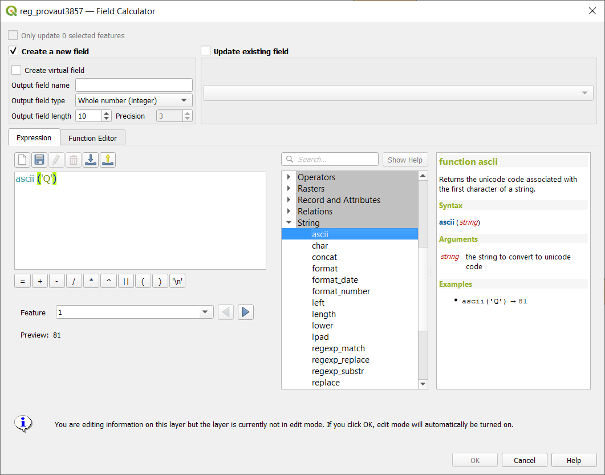

[↑ come back ↑](#features)

## Support pasting pictures directly into layouts
- **Author:** [nyalldawson](https://github.com/nyalldawson)
- **milestone:** 3.14.0
- **PR:** [35821](https://github.com/qgis/QGIS/pull/35821)
- **Merged:** 2020-04-17T03:48:07Z
- **tags:** Print Layouts

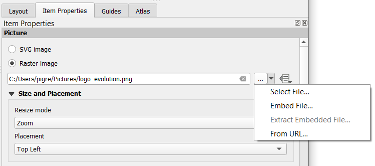

[↑ come back ↑](#features)

## Add vector tiles to Datasource manager dialog and Layers menu
- **Author:** [alexbruy](https://github.com/alexbruy)
- **milestone:** 3.14.0
- **PR:** [35815](https://github.com/qgis/QGIS/pull/35815)
- **Merged:** 2020-04-17T08:59:40Z
- **tags:** GUI/UX

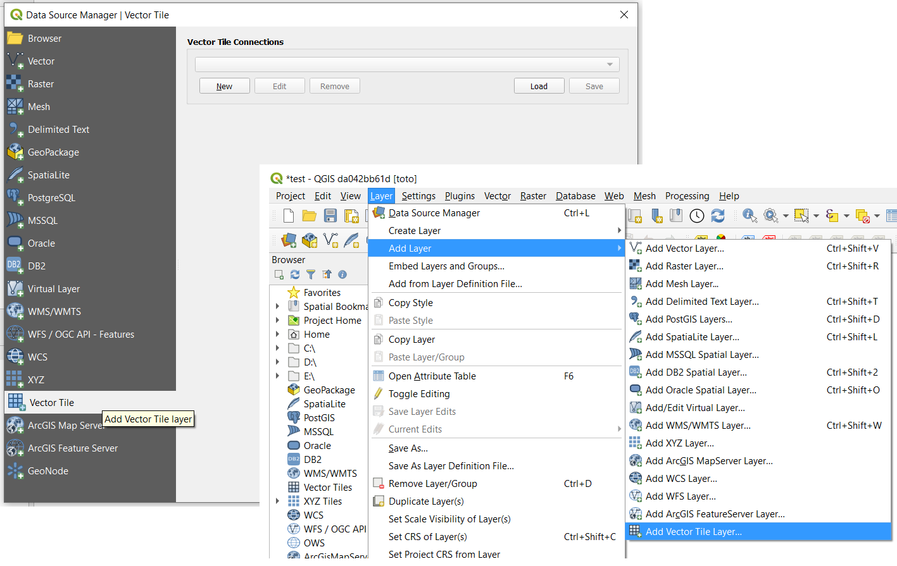

[↑ come back ↑](#features)

## New modeler algorithm for creating conditional branches
- **Author:** [nyalldawson](https://github.com/nyalldawson)
- **milestone:** 3.14.0
- **PR:** [35808](https://github.com/qgis/QGIS/pull/35808)
- **Merged:** 2020-04-16T06:02:54Z
- **tags:** Processing
- **Sponsored by:** Andreas Neumann


[↑ come back ↑](#features)

## import/export for ArcGIS Map and FeatureServer connections
- **Author:** [alexbruy](https://github.com/alexbruy)
- **milestone:** 3.14.0
- **PR:** [35790](https://github.com/qgis/QGIS/pull/35790)
- **Merged:** 2020-04-15T17:20:24Z
- **tags:** -

[↑ come back ↑](#features)

## Allow reordering model inputs
- **Author:** [nyalldawson](https://github.com/nyalldawson)
- **milestone:** 3.14.0
- **PR:** [35778](https://github.com/qgis/QGIS/pull/35778)
- **Merged:** 2020-04-15T20:03:49Z
- **tags:** Processing
- **Sponsored by:** NaturalGIS

[↑ come back ↑](#features)

## Add XYZ tiles to Datasource manager dialog and Layers menu
- **Author:** [alexbruy](https://github.com/alexbruy)
- **milestone:** 3.14.0
- **PR:** [35764](https://github.com/qgis/QGIS/pull/35764)
- **Merged:** 2020-04-15T08:26:24Z
- **tags:** GUI/UX

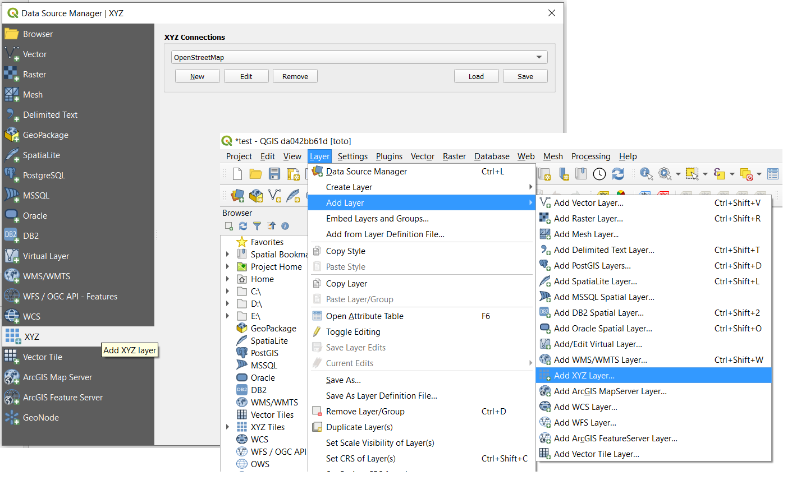

[↑ come back ↑](#features)

## Defer model validation
- **Author:** [nyalldawson](https://github.com/nyalldawson)
- **milestone:** 3.14.0
- **PR:** [35760](https://github.com/qgis/QGIS/pull/35760)
- **Merged:** 2020-04-14T10:27:22Z
- **tags:** Processing

[↑ come back ↑](#features)

## Vector tile layer - part 5 (identify tool)
- **Author:** [wonder-sk](https://github.com/wonder-sk)
- **milestone:** 3.14.0
- **PR:** [35748](https://github.com/qgis/QGIS/pull/35748)
- **Merged:** 2020-04-15T11:38:21Z
- **tags:** Vector tiles
- **Donors:** <https://www.lutraconsulting.co.uk/blog/2020/04/02/vectortiles-donors/>


[↑ come back ↑](#features)

## Server: add QGIS_SERVER_IGNORE_BAD_LAYERS config option
- **Author:** [elpaso](https://github.com/elpaso)
- **milestone:** 3.14.0
- **PR:** [35738](https://github.com/qgis/QGIS/pull/35738)
- **Merged:** 2020-04-14T05:57:10Z
- **tags:** Server
- **Funded by:** Geoinformatikbüro Dassau GmbH

[↑ come back ↑](#features)

## Add support for different raster data types in Create constant raster layer algorithm
- **Author:** [root676](https://github.com/root676)
- **milestone:** 3.14.0
- **PR:** [35727](https://github.com/qgis/QGIS/pull/35727)
- **Merged:** 2020-04-13T23:20:57Z
- **tags:** Processing

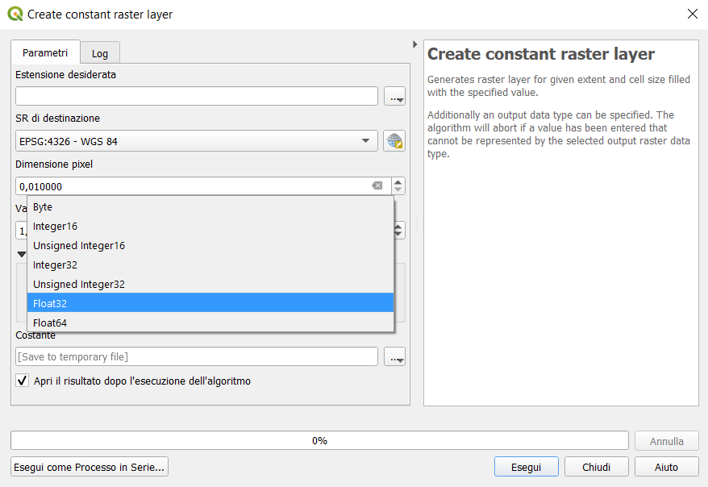

[↑ come back ↑](#features)

## add native Round raster algorithm
- **Author:** [root676](https://github.com/root676)
- **milestone:** 3.14.0
- **PR:** [35694](https://github.com/qgis/QGIS/pull/35694)
- **Merged:** 2020-04-12T21:34:27Z
- **tags:** Processing

 

[↑ come back ↑](#features)

## Add avoid intersection/overlap mode
- **Author:** [nirvn](https://github.com/nirvn)
- **milestone:** 3.14.0
- **PR:** [35689](https://github.com/qgis/QGIS/pull/35689)
- **Merged:** 2020-04-10T06:42:08Z
- **tags:** Digitizing
- **Sponsored by:** QField


[↑ come back ↑](#features)

## Forms: expression controlled aliases (labels)
- **Author:** [elpaso](https://github.com/elpaso)
- **milestone:** 3.14.0
- **PR:** [35688](https://github.com/qgis/QGIS/pull/35688)
- **Merged:** 2020-04-15T13:09:15Z
- **tags:** Forms
- **Funded by:** ARPA Piemonte


[↑ come back ↑](#features)

## Vector tile layer - part 4 (labeling)
- **Author:** [wonder-sk](https://github.com/wonder-sk)
- **milestone:** 3.14.0
- **PR:** [35657](https://github.com/qgis/QGIS/pull/35657)
- **Merged:** 2020-04-14T22:33:30Z
- **tags:** Vector tiles
- **Donors:** <https://www.lutraconsulting.co.uk/blog/2020/04/02/vectortiles-donors/>


[↑ come back ↑](#features)

## Allow copying/cut/paste of model components
- **Author:** [nyalldawson](https://github.com/nyalldawson)
- **milestone:** 3.14.0
- **PR:** [35644](https://github.com/qgis/QGIS/pull/35644)
- **Merged:** 2020-04-14T04:36:03Z
- **tags:** Processing


[↑ come back ↑](#features)

## Allow appending processing results to existing layers
- **Author:** [nyalldawson](https://github.com/nyalldawson)
- **milestone:** 3.14.0
- **PR:** [35641](https://github.com/qgis/QGIS/pull/35641)
- **Merged:** 2020-04-07T07:05:45Z
- **tags:** Processing


[↑ come back ↑](#features)

## Allow plugins to register custom Project Open handlers
- **Author:** [nyalldawson](https://github.com/nyalldawson)
- **milestone:** 3.14.0
- **PR:** [35606](https://github.com/qgis/QGIS/pull/35606)
- **Merged:** 2020-04-06T23:18:50Z
- **tags:** API


[↑ come back ↑](#features)

## Allow marker items to sync rotation with maps
- **Author:** [nyalldawson](https://github.com/nyalldawson)
- **milestone:** 3.14.0
- **PR:** [35591](https://github.com/qgis/QGIS/pull/35591)
- **Merged:** 2020-04-06T04:04:21Z
- **tags:** Print Layouts
- **Sponsored by:** SLYR


[↑ come back ↑](#features)

## New item type for marker symbols
- **Author:** [nyalldawson](https://github.com/nyalldawson)
- **milestone:** 3.14.0
- **PR:** [35576](https://github.com/qgis/QGIS/pull/35576)
- **Merged:** 2020-04-05T04:23:23Z
- **tags:** Print Layouts


[↑ come back ↑](#features)

## Expression builder add layer_property
- **Author:** [jmonticolo](https://github.com/jmonticolo)
- **milestone:** 3.14.0
- **PR:** [35559](https://github.com/qgis/QGIS/pull/35559)
- **Merged:** 2020-04-06T23:20:39Z
- **tags:** Expressions

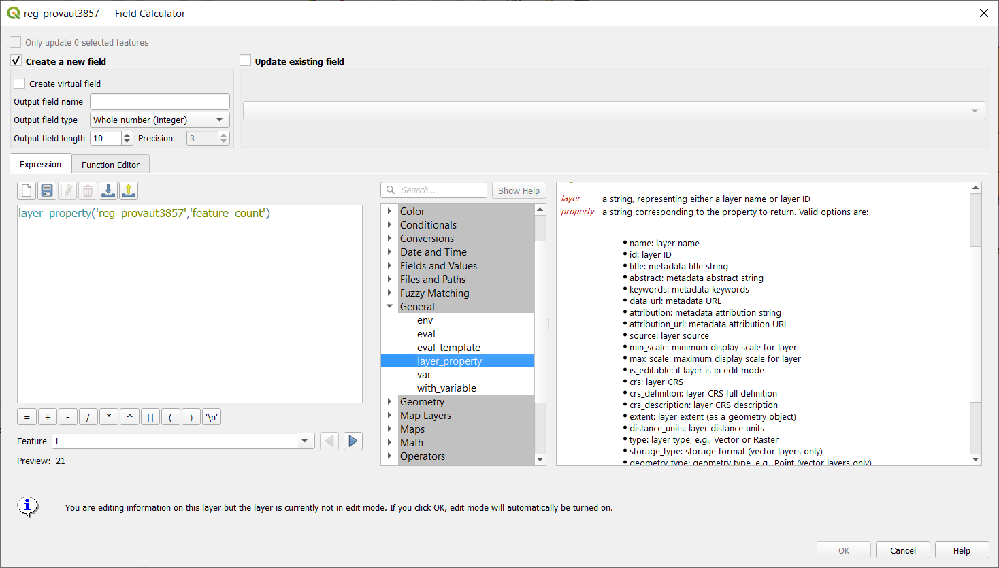

[↑ come back ↑](#features)

## Added move to bottom in layertreeview context menu
- **Author:** [uclaros](https://github.com/uclaros)
- **milestone:** 3.14.0
- **PR:** [35531](https://github.com/qgis/QGIS/pull/35531)
- **Merged:** 2020-04-04T22:05:29Z
- **tags:** -

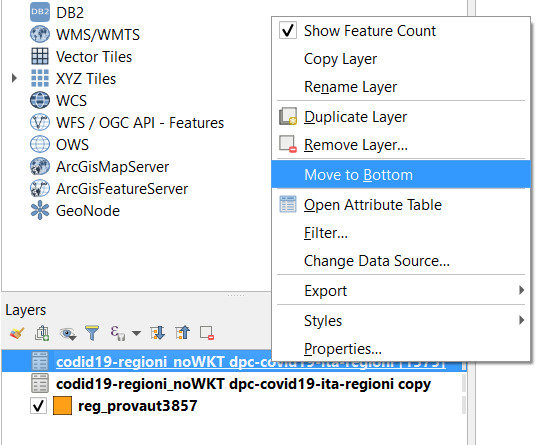

[↑ come back ↑](#features)

## Show a menu next to scale widget buttons, to allow setting the widget directly to a scale from a print layout map
- **Author:** [nyalldawson](https://github.com/nyalldawson)
- **milestone:** 3.14.0
- **PR:** [35518](https://github.com/qgis/QGIS/pull/35518)
- **Merged:** 2020-04-02T23:06:10Z
- **tags:** GUI/UX


[↑ come back ↑](#features)

## Postgres raster temporal API support
- **Author:** [elpaso](https://github.com/elpaso)
- **milestone:** 3.14.0
- **PR:** [35511](https://github.com/qgis/QGIS/pull/35511)
- **Merged:** 2020-04-06T19:54:23Z
- **tags:** Data Provider;Raster
- **Funded by:** ARPA Piemonte


[↑ come back ↑](#features)

## Allow creation of group boxes in models
- **Author:** [nyalldawson](https://github.com/nyalldawson)
- **milestone:** 3.14.0
- **PR:** [35494](https://github.com/qgis/QGIS/pull/35494)
- **Merged:** 2020-04-01T08:20:10Z
- **tags:** Processing


[↑ come back ↑](#features)

## Spatialite provider transactions
- **Author:** [elpaso](https://github.com/elpaso)
- **milestone:** 3.14.0
- **PR:** [35488](https://github.com/qgis/QGIS/pull/35488)
- **Merged:** 2020-04-01T09:15:15Z
- **tags:** Data Provider
- **Funded by:** ARPA Piemonte

[↑ come back ↑](#features)

## Port output parameter wrappers to new API
- **Author:** [nyalldawson](https://github.com/nyalldawson)
- **milestone:** 3.14.0
- **PR:** [35484](https://github.com/qgis/QGIS/pull/35484)
- **Merged:** 2020-04-01T16:29:55Z
- **tags:** Processing


[↑ come back ↑](#features)

## Add import content from clipboard for fixed table items
- **Author:** [nirvn](https://github.com/nirvn)
- **milestone:** 3.14.0
- **PR:** [35475](https://github.com/qgis/QGIS/pull/35475)
- **Merged:** 2020-03-31T10:21:11Z
- **tags:** Print Layouts


[↑ come back ↑](#features)

## Processing: show input and output values for children after running model through designer
- **Author:** [nyalldawson](https://github.com/nyalldawson)
- **milestone:** 3.14.0
- **PR:** [35474](https://github.com/qgis/QGIS/pull/35474)
- **Merged:** 2020-03-31T09:35:52Z
- **tags:** Processing


[↑ come back ↑](#features)

## Add Save Log to File algorithm for models
- **Author:** [nyalldawson](https://github.com/nyalldawson)
- **milestone:** 3.14.0
- **PR:** [35473](https://github.com/qgis/QGIS/pull/35473)
- **Merged:** 2020-03-31T09:35:30Z
- **tags:** Processing

[↑ come back ↑](#features)

## plug mesh layer to QGIS temporal framework
- **Author:** [vcloarec](https://github.com/vcloarec)
- **milestone:** 3.14.0
- **PR:** [35466](https://github.com/qgis/QGIS/pull/35466)
- **Merged:** 2020-04-03T06:21:16Z
- **tags:** Mesh


[↑ come back ↑](#features)

## Network logger - more functionality
- **Author:** [nyalldawson](https://github.com/nyalldawson)
- **milestone:** 3.14.0
- **PR:** [35454](https://github.com/qgis/QGIS/pull/35454)
- **Merged:** 2020-03-31T02:53:44Z
- **tags:** -

[↑ come back ↑](#features)

## Port last remaining input parameters to new API
- **Author:** [nyalldawson](https://github.com/nyalldawson)
- **milestone:** 3.14.0
- **PR:** [35452](https://github.com/qgis/QGIS/pull/35452)
- **Merged:** 2020-03-30T15:06:49Z
- **tags:** Processing

[↑ come back ↑](#features)

## Raster Layer Contour Renderer
- **Author:** [wonder-sk](https://github.com/wonder-sk)
- **milestone:** 3.14.0
- **PR:** [35446](https://github.com/qgis/QGIS/pull/35446)
- **Merged:** 2020-03-31T06:51:55Z
- **tags:** Symbology


[↑ come back ↑](#features)

## Add percentage size unit for Raster Image Marker and Raster fill layers symbology.
- **Author:** [beketata](https://github.com/beketata)
- **milestone:** 3.14.0
- **PR:** [35438](https://github.com/qgis/QGIS/pull/35438)
- **Merged:** 2020-04-07T22:32:21Z
- **tags:** Symbology

 

[↑ come back ↑](#features)

## Port Feature Source, Raster, Vector and Mesh Layer parameters to new API
- **Author:** [nyalldawson](https://github.com/nyalldawson)
- **milestone:** 3.14.0
- **PR:** [35419](https://github.com/qgis/QGIS/pull/35419)
- **Merged:** 2020-03-28T19:56:24Z
- **tags:** Processing

[↑ come back ↑](#features)

## Server project settings, add 'expanded' attribute
- **Author:** [mhugent](https://github.com/mhugent)
- **milestone:** 3.14.0
- **PR:** [35408](https://github.com/qgis/QGIS/pull/35408)
- **Merged:** 2020-03-30T05:35:07Z
- **tags:** Server

[↑ come back ↑](#features)

## Inbuilt network logging tool
- **Author:** [nyalldawson](https://github.com/nyalldawson)
- **milestone:** 3.14.0
- **PR:** [35396](https://github.com/qgis/QGIS/pull/35396)
- **Merged:** 2020-03-30T06:54:23Z
- **tags:** -


[↑ come back ↑](#features)

## Allowing saving outputs direct to more database formats (and other nice stuff)
- **Author:** [nyalldawson](https://github.com/nyalldawson)
- **milestone:** 3.14.0
- **PR:** [35364](https://github.com/qgis/QGIS/pull/35364)
- **Merged:** 2020-03-26T15:30:28Z
- **tags:** Processing


[↑ come back ↑](#features)

## Vector tile layer - part 1
- **Author:** [wonder-sk](https://github.com/wonder-sk)
- **milestone:** 3.14.0
- **PR:** [35341](https://github.com/qgis/QGIS/pull/35341)
- **Merged:** 2020-04-02T14:06:31Z
- **tags:** Vector tiles
- **Donors:** <https://www.lutraconsulting.co.uk/blog/2020/04/02/vectortiles-donors/>


[↑ come back ↑](#features)

## Allow running algorithms directly on database (and other non-disk) sources without loading into projects first
- **Author:** [nyalldawson](https://github.com/nyalldawson)
- **milestone:** 3.14.0
- **PR:** [35324](https://github.com/qgis/QGIS/pull/35324)
- **Merged:** 2020-03-26T01:55:47Z
- **tags:** Processing


[↑ come back ↑](#features)

## Port processing extent parameter to new api, many other improvements
- **Author:** [nyalldawson](https://github.com/nyalldawson)
- **milestone:** 3.14.0
- **PR:** [35321](https://github.com/qgis/QGIS/pull/35321)
- **Merged:** 2020-03-25T09:25:42Z
- **tags:** Processing

[↑ come back ↑](#features)

## Interface and API for unified development/debugging tools
- **Author:** [nyalldawson](https://github.com/nyalldawson)
- **milestone:** 3.14.0
- **PR:** [35319](https://github.com/qgis/QGIS/pull/35319)
- **Merged:** 2020-03-25T10:03:19Z
- **tags:** API


[↑ come back ↑](#features)

## Expose per-feature-source advanced options for processing inputs
- **Author:** [nyalldawson](https://github.com/nyalldawson)
- **milestone:** 3.14.0
- **PR:** [35292](https://github.com/qgis/QGIS/pull/35292)
- **Merged:** 2020-03-24T23:42:18Z
- **tags:** Processing


[↑ come back ↑](#features)

## Resampling from vertex values to face values
- **Author:** [vcloarec](https://github.com/vcloarec)
- **milestone:** 3.14.0
- **PR:** [35264](https://github.com/qgis/QGIS/pull/35264)
- **Merged:** 2020-03-24T09:03:55Z
- **tags:** Mesh


[↑ come back ↑](#features)

## Enable snapping to grid for models in designer
- **Author:** [nyalldawson](https://github.com/nyalldawson)
- **milestone:** 3.14.0
- **PR:** [35251](https://github.com/qgis/QGIS/pull/35251)
- **Merged:** 2020-03-23T09:25:34Z
- **tags:** Processing

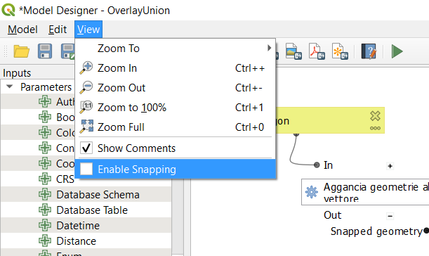

[↑ come back ↑](#features)

## Add numeric formatter fraction style
- **Author:** [nyalldawson](https://github.com/nyalldawson)
- **milestone:** 3.14.0
- **PR:** [35244](https://github.com/qgis/QGIS/pull/35244)
- **Merged:** 2020-03-23T04:24:38Z
- **tags:** Print Layouts
- **Sponsored by:** SLYR


[↑ come back ↑](#features)

## Add stepped line and hollow scalebar styles
- **Author:** [nyalldawson](https://github.com/nyalldawson)
- **milestone:** 3.14.0
- **PR:** [35238](https://github.com/qgis/QGIS/pull/35238)
- **Merged:** 2020-03-22T17:08:51Z
- **tags:** Print Layouts
- **Sponsored by:** SLYR


[↑ come back ↑](#features)

## Allow scalebar line style to be set using standard QGIS line symbols
- **Author:** [nyalldawson](https://github.com/nyalldawson)
- **milestone:** 3.14.0
- **PR:** [35225](https://github.com/qgis/QGIS/pull/35225)
- **Merged:** 2020-03-22T06:41:32Z
- **tags:** Print Layouts
- **Sponsored by:** SLYR

[↑ come back ↑](#features)

## Add data-defined property to font family/style for font markers
- **Author:** [nirvn](https://github.com/nirvn)
- **milestone:** 3.14.0
- **PR:** [35224](https://github.com/qgis/QGIS/pull/35224)
- **Merged:** 2020-03-22T05:24:09Z
- **tags:** Symbology


[↑ come back ↑](#features)

## coloring mesh vector dataset with color ramp shader
- **Author:** [vcloarec](https://github.com/vcloarec)
- **milestone:** 3.14.0
- **PR:** [35216](https://github.com/qgis/QGIS/pull/35216)
- **Merged:** 2020-03-24T08:58:49Z
- **tags:** Mesh


[↑ come back ↑](#features)

## add maptip, expression display and eval_template expressions
- **Author:** [Gustry](https://github.com/Gustry)
- **milestone:** 3.14.0
- **PR:** [35211](https://github.com/qgis/QGIS/pull/35211)
- **Merged:** 2020-03-25T23:24:20Z
- **tags:** Expressions

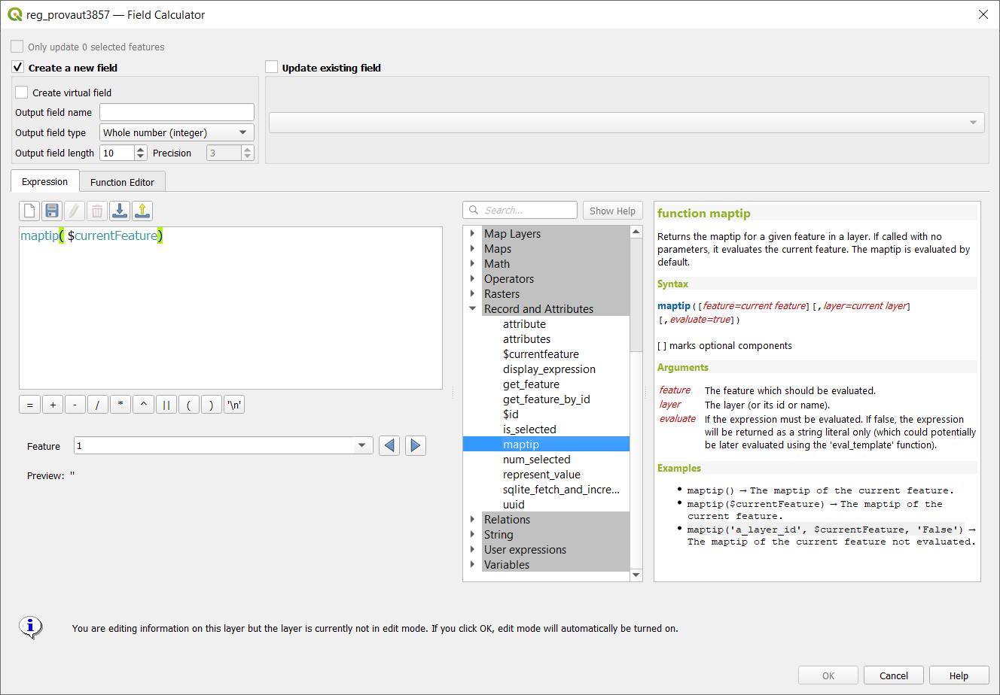

[↑ come back ↑](#features)

## Add @layers, @layer_ids project scope variables
- **Author:** [nyalldawson](https://github.com/nyalldawson)
- **milestone:** 3.14.0
- **PR:** [35208](https://github.com/qgis/QGIS/pull/35208)
- **Merged:** 2020-03-20T02:56:23Z
- **tags:** Expressions
- **Sponsored by:** SLYR

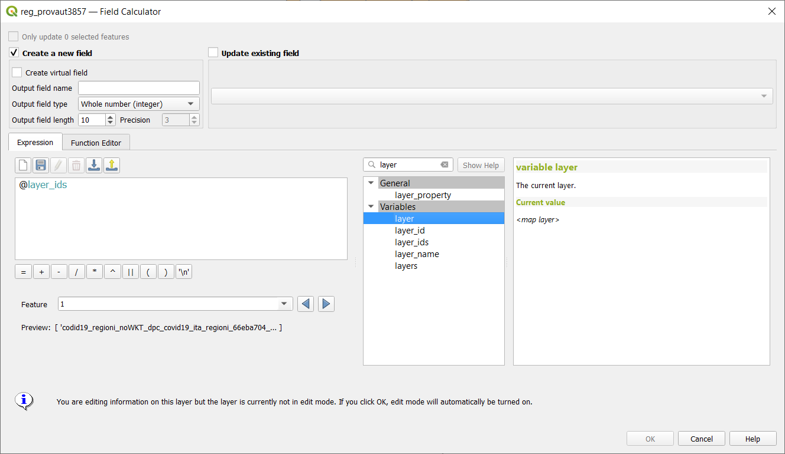

[↑ come back ↑](#features)

## Add a font style setting for font markers
- **Author:** [nirvn](https://github.com/nirvn)
- **milestone:** 3.14.0
- **PR:** [35197](https://github.com/qgis/QGIS/pull/35197)
- **Merged:** 2020-03-21T05:11:17Z
- **tags:** Symbology

[↑ come back ↑](#features)

## Rework picture item UI and behavior
- **Author:** [nyalldawson](https://github.com/nyalldawson)
- **milestone:** 3.14.0
- **PR:** [35160](https://github.com/qgis/QGIS/pull/35160)
- **Merged:** 2020-03-19T03:18:49Z
- **tags:** Print Layouts
- **Sponsored by:** SLYR

[↑ come back ↑](#features)

## Add filter by geometry type and filter by layer type algorithms to processing
- **Author:** [nyalldawson](https://github.com/nyalldawson)
- **milestone:** 3.14.0
- **PR:** [35130](https://github.com/qgis/QGIS/pull/35130)
- **Merged:** 2020-03-17T16:52:38Z
- **tags:** Processing

[↑ come back ↑](#features)

## Add ability to edit, import and export user expressions
- **Author:** [suricactus](https://github.com/suricactus)
- **milestone:** 3.14.0
- **PR:** [34997](https://github.com/qgis/QGIS/pull/34997)
- **Merged:** 2020-03-17T10:31:38Z
- **tags:** GUI/UX

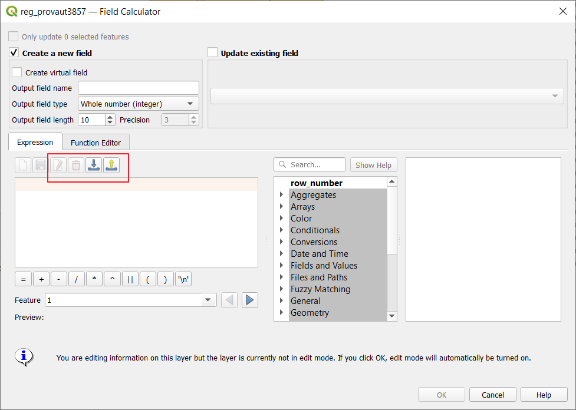

[↑ come back ↑](#features)

## Make Add Group button act as Group Selected if selected layers >= 2
- **Author:** [uclaros](https://github.com/uclaros)
- **milestone:** 3.14.0
- **PR:** [35097](https://github.com/qgis/QGIS/pull/35097)
- **Merged:** 2020-03-16T02:11:08Z
- **tags:** GUI/UX


[↑ come back ↑](#features)

- ## Add toolbutton to Deselect Features from the Current Active layer
- **Author:** [suricactus](https://github.com/suricactus)
- **milestone:** 3.14.0
- **PR:** [35085](https://github.com/qgis/QGIS/pull/35085)
- **Merged:** 2020-03-18T03:26:49Z
- **tags:** GUI/UX


[↑ come back ↑](#features)

## Optionally, also remove EMPTY geometries in RemoveNullGeometries algorithm
- **Author:** [gacarrillor](https://github.com/gacarrillor)
- **milestone:** 3.14.0
- **PR:** [35084](https://github.com/qgis/QGIS/pull/35084)
- **Merged:** 2020-03-15T07:37:53Z
- **tags:** Processing


[↑ come back ↑](#features)

## Data type support for QgsProcessingParameterMapLayer
- **Author:** [alexbruy](https://github.com/alexbruy)
- **milestone:** 3.14.0
- **PR:** [35076](https://github.com/qgis/QGIS/pull/35076)
- **Merged:** 2020-03-15T14:14:21Z
- **tags:** Processing

[↑ come back ↑](#features)

## Add processing parameter types for database schema and table name
- **Author:** [nyalldawson](https://github.com/nyalldawson)
- **milestone:** 3.14.0
- **PR:** [35056](https://github.com/qgis/QGIS/pull/35056)
- **Merged:** 2020-03-14T06:57:16Z
- **tags:** Processing

[↑ come back ↑](#features)

## Add description to value relation widget
- **Author:** [m-kuhn](https://github.com/m-kuhn)
- **milestone:** 3.14.0
- **PR:** [35035](https://github.com/qgis/QGIS/pull/35035)
- **Merged:** 2020-03-17T14:32:47Z
- **tags:** Forms


[↑ come back ↑](#features)

## Add multi-selection handling to model designer, interactive resizing
- **Author:** [nyalldawson](https://github.com/nyalldawson)
- **milestone:** 3.14.0
- **PR:** [34987](https://github.com/qgis/QGIS/pull/34987)
- **Merged:** 2020-03-12T03:14:34Z
- **tags:** Processing


[↑ come back ↑](#features)

## New database table name widget
- **Author:** [elpaso](https://github.com/elpaso)
- **milestone:** 3.14.0
- **PR:** [34968](https://github.com/qgis/QGIS/pull/34968)
- **Merged:** 2020-03-12T20:35:54Z
- **tags:** API;QGIS Browser


[↑ come back ↑](#features)

## Add dedicated parameter type for database connections
- **Author:** [nyalldawson](https://github.com/nyalldawson)
- **milestone:** 3.14.0
- **PR:** [34955](https://github.com/qgis/QGIS/pull/34955)
- **Merged:** 2020-03-10T09:10:54Z
- **tags:** Processing

[↑ come back ↑](#features)

## arrows for 3D mesh layer dataset rendering
- **Author:** [vcloarec](https://github.com/vcloarec)
- **milestone:** 3.14.0
- **PR:** [34945](https://github.com/qgis/QGIS/pull/34945)
- **Merged:** 2020-03-11T06:51:03Z
- **tags:** Mesh


[↑ come back ↑](#features)

## Add undo/redo support to model designer
- **Author:** [nyalldawson](https://github.com/nyalldawson)
- **milestone:** 3.14.0
- **PR:** [34938](https://github.com/qgis/QGIS/pull/34938)
- **Merged:** 2020-03-10T22:39:55Z
- **tags:** Processing


[↑ come back ↑](#features)

## Add control over anchor point for callout on label
- **Author:** [nyalldawson](https://github.com/nyalldawson)
- **milestone:** 3.14.0
- **PR:** [34936](https://github.com/qgis/QGIS/pull/34936)
- **Merged:** 2020-03-09T05:29:52Z
- **tags:** Labeling


[↑ come back ↑](#features)

## PG expose foreign tables
- **Author:** [elpaso](https://github.com/elpaso)
- **milestone:** 3.14.0
- **PR:** [34914](https://github.com/qgis/QGIS/pull/34914)
- **Merged:** 2020-03-07T03:55:30Z
- **tags:** Data Provider

[↑ come back ↑](#features)

## Add expression variables for current map temporal range
- **Author:** [nyalldawson](https://github.com/nyalldawson)
- **milestone:** 3.14.0
- **PR:** [34898](https://github.com/qgis/QGIS/pull/34898)
- **Merged:** 2020-03-08T21:29:46Z
- **tags:** Expressions

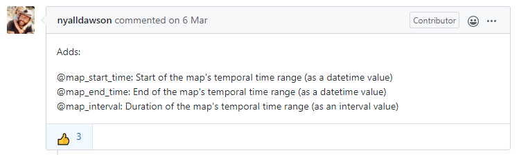

[↑ come back ↑](#features)

## Remember parameter values between model designer runs
- **Author:** [nyalldawson](https://github.com/nyalldawson)
- **milestone:** 3.14.0
- **PR:** [34895](https://github.com/qgis/QGIS/pull/34895)
- **Merged:** 2020-03-06T08:22:51Z
- **tags:** Processing
- **Sponsored by:** Alta Ehf

[↑ come back ↑](#features)

## Plugin manager allow to install stable or experimental
- **Author:** [olivierdalang](https://github.com/olivierdalang)
- **milestone:** 3.14.0
- **PR:** [34876](https://github.com/qgis/QGIS/pull/34876)
- **Merged:** 2020-03-15T19:31:18Z
- **tags:** Plugins


[↑ come back ↑](#features)

## PG raster expose set filter to app
- **Author:** [elpaso](https://github.com/elpaso)
- **milestone:** 3.14.0
- **PR:** [34871](https://github.com/qgis/QGIS/pull/34871)
- **Merged:** 2020-03-05T14:34:33Z
- **tags:** Data Provider;Raster
- **Funded by**: ARPA Piemonte


[↑ come back ↑](#features)

## Comments in Processing Models
- **Author:** [nyalldawson](https://github.com/nyalldawson)
- **milestone:** 3.14.0
- **PR:** [34856](https://github.com/qgis/QGIS/pull/34856)
- **Merged:** 2020-03-05T17:49:17Z
- **tags:** Processing
- **Funded by:** Fisel + König


[↑ come back ↑](#features)

## Mesh 1D Renderer
- **Author:** [PeterPetrik](https://github.com/PeterPetrik)
- **milestone:** 3.14.0
- **PR:** [34848](https://github.com/qgis/QGIS/pull/34848)
- **Merged:** 2020-03-09T04:59:52Z
- **tags:** Mesh


[↑ come back ↑](#features)

## Get current parent form values in child forms
- **Author:** [elpaso](https://github.com/elpaso)
- **milestone:** 3.14.0
- **PR:** [34827](https://github.com/qgis/QGIS/pull/34827)
- **Merged:** 2020-03-05T09:51:44Z
- **tags:** Forms
- **Funded by:** ARPA Piemonte


[↑ come back ↑](#features)

## Relation wdgt: add checkbox to hide save child edits button
- **Author:** [elpaso](https://github.com/elpaso)
- **milestone:** 3.14.0
- **PR:** [34760](https://github.com/qgis/QGIS/pull/34760)
- **Merged:** 2020-02-28T14:52:46Z
- **tags:** Forms;GUI/UX


[↑ come back ↑](#features)

## Relation widget force suppress popup
- **Author:** [elpaso](https://github.com/elpaso)
- **milestone:** 3.14.0
- **PR:** [34654](https://github.com/qgis/QGIS/pull/34654)
- **Merged:** 2020-02-27T07:11:45Z
- **tags:** Forms


[↑ come back ↑](#features)

## New standalone console tool for running processing algorithms
- **Author:** [nyalldawson](https://github.com/nyalldawson)
- **milestone:** 3.14.0
- **PR:** [34617](https://github.com/qgis/QGIS/pull/34617)
- **Merged:** 2020-04-15T08:20:28Z
- **tags:** Processing
- **Sponsored by:** the Swedish User Group

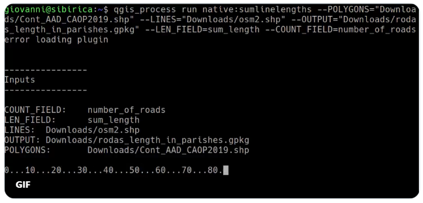

https://twitter.com/i/status/1250506567528722433

[↑ come back ↑](#features)

## New parameter type for Merged (or date, or time) values
- **Author:** [nyalldawson](https://github.com/nyalldawson)
- **milestone:** 3.14.0
- **PR:** [34610](https://github.com/qgis/QGIS/pull/34610)
- **Merged:** 2020-02-24T07:23:42Z
- **tags:** Processing

[↑ come back ↑](#features)

## QGIS Project temporal settings
- **Author:** [Samweli](https://github.com/Samweli)
- **milestone:** 3.14.0
- **PR:** [34590](https://github.com/qgis/QGIS/pull/34590)
- **Merged:** 2020-03-06T21:43:14Z
- **tags:** Temporal


[↑ come back ↑](#features)

## Make CRS controlable by a variable
- **Author:** [roya0045](https://github.com/roya0045)
- **milestone:** 3.14.0
- **PR:** [34547](https://github.com/qgis/QGIS/pull/34547)
- **Merged:** 2020-02-22T20:50:56Z
- **tags:** Print Layouts


[↑ come back ↑](#features)

## Mesh simplification
- **Author:** [vcloarec](https://github.com/vcloarec)
- **milestone:** 3.14.0
- **PR:** [34532](https://github.com/qgis/QGIS/pull/34532)
- **Merged:** 2020-02-25T07:05:50Z
- **tags:** Mesh


[↑ come back ↑](#features)

## WMS-T layers temporal constrains support
- **Author:** [Samweli](https://github.com/Samweli)
- **milestone:** 3.14.0
- **PR:** [34497](https://github.com/qgis/QGIS/pull/34497)
- **Merged:** 2020-03-05T08:41:37Z
- **tags:** -


[↑ come back ↑](#features)

## Temporal API
- **Author:** [Samweli](https://github.com/Samweli)
- **PR:** [34040](https://github.com/qgis/QGIS/pull/34040)
- **Merged:** 2020-02-24T03:48:40Z
- **tags:** API

[↑ come back ↑](#features)

## New snapping modes: Centroid and middle of a segment (midpoint)
- **Author:** [lbartoletti](https://github.com/lbartoletti)
- **milestone:** 3.14.0
- **PR:** [33622](https://github.com/qgis/QGIS/pull/33622)
- **Merged:** 2020-03-02T08:02:36Z
- **tags:** Digitizing
- **Sponsored by:** Qwat group / Ville de Lausanne ( [@ponceta](https://github.com/ponceta) [@dsavary](https://github.com/dsavary) ) / Oslandia and some spare time


[↑ come back ↑](#features)

## Show 'template layer' constraints info in the Refactor fields algorithm's UI
- **Author:** [gacarrillor](https://github.com/gacarrillor)
- **milestone:** 3.14.0
- **PR:** [31387](https://github.com/qgis/QGIS/pull/31387)
- **Merged:** 2020-03-18T06:10:07Z
- **tags:** Processing


[↑ come back ↑](#features)

# Statistics

## Authors

| Author | PR | Total_count |
| --- | --- | --- |
| nyalldawson | [36303](https://github.com/qgis/QGIS/pull/36303) [36300](https://github.com/qgis/QGIS/pull/36300) [36299](https://github.com/qgis/QGIS/pull/36299) [36245](https://github.com/qgis/QGIS/pull/36245) [36243](https://github.com/qgis/QGIS/pull/36243) [36224](https://github.com/qgis/QGIS/pull/36224) [36222](https://github.com/qgis/QGIS/pull/36222) [36162](https://github.com/qgis/QGIS/pull/36162) [36136](https://github.com/qgis/QGIS/pull/36136) [36106](https://github.com/qgis/QGIS/pull/36106) [36013](https://github.com/qgis/QGIS/pull/36013) [35974](https://github.com/qgis/QGIS/pull/35974) [35909](https://github.com/qgis/QGIS/pull/35909) [35863](https://github.com/qgis/QGIS/pull/35863) [35821](https://github.com/qgis/QGIS/pull/35821) [35808](https://github.com/qgis/QGIS/pull/35808) [35778](https://github.com/qgis/QGIS/pull/35778) [35760](https://github.com/qgis/QGIS/pull/35760) [35644](https://github.com/qgis/QGIS/pull/35644) [35641](https://github.com/qgis/QGIS/pull/35641) [35606](https://github.com/qgis/QGIS/pull/35606) [35591](https://github.com/qgis/QGIS/pull/35591) [35576](https://github.com/qgis/QGIS/pull/35576) [35518](https://github.com/qgis/QGIS/pull/35518) [35494](https://github.com/qgis/QGIS/pull/35494) [35484](https://github.com/qgis/QGIS/pull/35484) [35474](https://github.com/qgis/QGIS/pull/35474) [35473](https://github.com/qgis/QGIS/pull/35473) [35454](https://github.com/qgis/QGIS/pull/35454) [35452](https://github.com/qgis/QGIS/pull/35452) [35419](https://github.com/qgis/QGIS/pull/35419) [35396](https://github.com/qgis/QGIS/pull/35396) [35364](https://github.com/qgis/QGIS/pull/35364) [35324](https://github.com/qgis/QGIS/pull/35324) [35321](https://github.com/qgis/QGIS/pull/35321) [35319](https://github.com/qgis/QGIS/pull/35319) [35292](https://github.com/qgis/QGIS/pull/35292) [35251](https://github.com/qgis/QGIS/pull/35251) [35244](https://github.com/qgis/QGIS/pull/35244) [35238](https://github.com/qgis/QGIS/pull/35238) [35225](https://github.com/qgis/QGIS/pull/35225) [35208](https://github.com/qgis/QGIS/pull/35208) [35160](https://github.com/qgis/QGIS/pull/35160) [35130](https://github.com/qgis/QGIS/pull/35130) [35056](https://github.com/qgis/QGIS/pull/35056) [34987](https://github.com/qgis/QGIS/pull/34987) [34955](https://github.com/qgis/QGIS/pull/34955) [34938](https://github.com/qgis/QGIS/pull/34938) [34936](https://github.com/qgis/QGIS/pull/34936) [34898](https://github.com/qgis/QGIS/pull/34898) [34895](https://github.com/qgis/QGIS/pull/34895) [34856](https://github.com/qgis/QGIS/pull/34856) [34617](https://github.com/qgis/QGIS/pull/34617) [34610](https://github.com/qgis/QGIS/pull/34610) [36453](https://github.com/qgis/QGIS/pull/36453) [36367](https://github.com/qgis/QGIS/pull/36367) [36324](https://github.com/qgis/QGIS/pull/36324) [36283](https://github.com/qgis/QGIS/pull/36283)  | 58 |
| elpaso | [35738](https://github.com/qgis/QGIS/pull/35738) [35688](https://github.com/qgis/QGIS/pull/35688) [35511](https://github.com/qgis/QGIS/pull/35511) [35488](https://github.com/qgis/QGIS/pull/35488) [34968](https://github.com/qgis/QGIS/pull/34968) [34914](https://github.com/qgis/QGIS/pull/34914) [34871](https://github.com/qgis/QGIS/pull/34871) [34827](https://github.com/qgis/QGIS/pull/34827) [34760](https://github.com/qgis/QGIS/pull/34760) [34654](https://github.com/qgis/QGIS/pull/34654) | 10 |
| vcloarec | [36171](https://github.com/qgis/QGIS/pull/36171) [35926](https://github.com/qgis/QGIS/pull/35926) [35466](https://github.com/qgis/QGIS/pull/35466) [35264](https://github.com/qgis/QGIS/pull/35264) [35216](https://github.com/qgis/QGIS/pull/35216) [34945](https://github.com/qgis/QGIS/pull/34945) [34532](https://github.com/qgis/QGIS/pull/34532) [36334](https://github.com/qgis/QGIS/pull/36334) [36313](https://github.com/qgis/QGIS/pull/36313)| 9 |
| alexbruy | [36202](https://github.com/qgis/QGIS/pull/36202) [35901](https://github.com/qgis/QGIS/pull/35901) [35815](https://github.com/qgis/QGIS/pull/35815) [35790](https://github.com/qgis/QGIS/pull/35790) [35764](https://github.com/qgis/QGIS/pull/35764) [35076](https://github.com/qgis/QGIS/pull/35076) [36289](https://github.com/qgis/QGIS/pull/36289) [36258](https://github.com/qgis/QGIS/pull/36258)  | 8 |
| 3nids | [36236](https://github.com/qgis/QGIS/pull/36236) [36190](https://github.com/qgis/QGIS/pull/36190) [36166](https://github.com/qgis/QGIS/pull/36166) [36089](https://github.com/qgis/QGIS/pull/36089) [35382](https://github.com/qgis/QGIS/pull/35382) [36199](https://github.com/qgis/QGIS/pull/36199) | 6 |
| wonder-sk | [36099](https://github.com/qgis/QGIS/pull/36099) [35748](https://github.com/qgis/QGIS/pull/35748) [35657](https://github.com/qgis/QGIS/pull/35657) [35446](https://github.com/qgis/QGIS/pull/35446) [35341](https://github.com/qgis/QGIS/pull/35341) | 5 |
| nirvn | [35689](https://github.com/qgis/QGIS/pull/35689) [35475](https://github.com/qgis/QGIS/pull/35475) [35224](https://github.com/qgis/QGIS/pull/35224) [35197](https://github.com/qgis/QGIS/pull/35197) [36304](https://github.com/qgis/QGIS/pull/36304) | 5 |
| JanCaha | [36069](https://github.com/qgis/QGIS/pull/36069) [35928](https://github.com/qgis/QGIS/pull/35928) [35889](https://github.com/qgis/QGIS/pull/35889) [35839](https://github.com/qgis/QGIS/pull/35839) | 4 |
| Samweli | [34590](https://github.com/qgis/QGIS/pull/34590) [34497](https://github.com/qgis/QGIS/pull/34497) [34040](https://github.com/qgis/QGIS/pull/34040) [36309](https://github.com/qgis/QGIS/pull/36309)  | 4 |
| root676 | [36130](https://github.com/qgis/QGIS/pull/36130) [35727](https://github.com/qgis/QGIS/pull/35727) [35694](https://github.com/qgis/QGIS/pull/35694) | 3 |
| gacarrillor | [35933](https://github.com/qgis/QGIS/pull/35933) [35084](https://github.com/qgis/QGIS/pull/35084) [31387](https://github.com/qgis/QGIS/pull/31387) | 3 |
| uclaros | [35531](https://github.com/qgis/QGIS/pull/35531) [35097](https://github.com/qgis/QGIS/pull/35097) | 2 |
| suricactus | [35085](https://github.com/qgis/QGIS/pull/35085) [34997](https://github.com/qgis/QGIS/pull/34997)  | 2 |
| agiudiceandrea | [36131](https://github.com/qgis/QGIS/pull/36131) | 1 |
| jmonticolo | [35559](https://github.com/qgis/QGIS/pull/35559) | 1 |
| beketata | [35438](https://github.com/qgis/QGIS/pull/35438) | 1 |
| mhugent | [35408](https://github.com/qgis/QGIS/pull/35408) | 1 |
| Gustry | [35211](https://github.com/qgis/QGIS/pull/35211) | 1 |
| m-kuhn | [35035](https://github.com/qgis/QGIS/pull/35035) | 1 |
| olivierdalang | [34876](https://github.com/qgis/QGIS/pull/34876) | 1 |
| PeterPetrik | [34848](https://github.com/qgis/QGIS/pull/34848) | 1 |
| roya0045 | [34547](https://github.com/qgis/QGIS/pull/34547) | 1 |
| DelazJ | [33950](https://github.com/qgis/QGIS/pull/33950) | 1 |
| lbartoletti | [33622](https://github.com/qgis/QGIS/pull/33622) | 1 |
| troopa81 | [35112](https://github.com/qgis/QGIS/pull/35112) | 1 |

[↑ come back ↑](#features)

## Tags

tags|count|percent|histogram
----|-----|-------|------
Processing|29|21.01|**************************************************
Print Layouts|18|13.04|*******************************
-|12|8.70|********************
GUI/UX|12|8.70|********************
Expressions|11|7.97|******************
Temporal|10|7.25|*****************
Mesh|10|7.25|*****************
Forms|6|4.35|**********
Data Provider|5|3.62|********
API|4|2.90|******
Vector tiles|4|2.90|******
Symbology|4|2.90|******
Labeling|2|1.45|***
Server|2|1.45|***
Digitizing|2|1.45|***
Raster|2|1.45|***
Vectors|1|0.72|*
Documentation|1|0.72|*
Map and Legend|1|0.72|*
QGIS Browser|1|0.72|*
Plugins|1|0.72|*

[↑ come back ↑](#features)

## Sponsors

Sponsored by|count
---|--
SLYR|11
the QGIS Swiss user group|6
ARPA Piemonte|5
<https://www.lutraconsulting.co.uk/blog/2020/04/02/vectortiles-donors/>|4
Geoinformatikbüro Dassau GmbH|1
Fisel + König|1
Andreas Neumann|1
NaturalGIS|1
QField|1
Alta Ehf|1
the Swedish User Group|1
Qwat group / Ville de Lausanne ( [@ponceta](https://github.com/ponceta) [@dsavary](https://github.com/dsavary) ) / Oslandia and some spare time|1
geoProRegio AG ([www.geoproregio.ch](http://www.geoproregio.ch/))|1


[↑ come back ↑](#features)

**stay tuned!**

---

**Useful references:**

- **VisiData** : https://www.visidata.org/
- **Miller** : https://github.com/johnkerl/miller
- **xq** : https://github.com/kislyuk/yq
- **Scrape** : https://github.com/aborruso/scrape-cli
- **curl** : https://curl.haxx.se/
- **Blog Pigrecoinfinito**: https://pigrecoinfinito.com/
