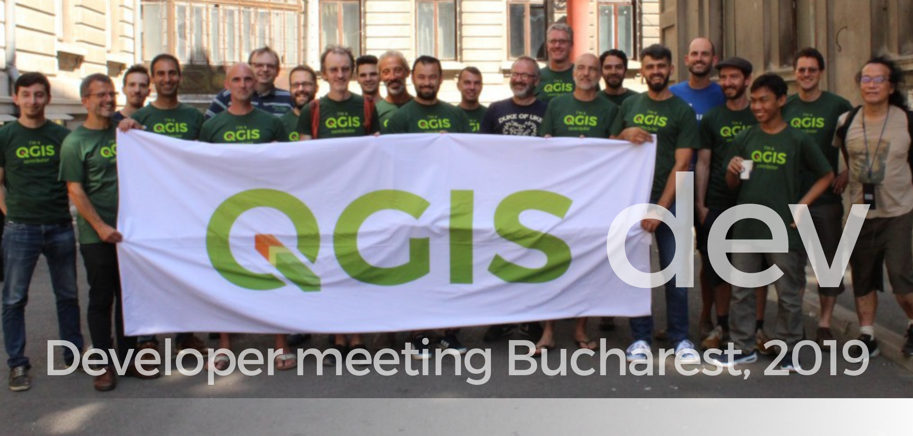

# Changelog 3.14 (Pi)

The following changelogs are the result of this [filter](https://github.com/qgis/QGIS/pulls?page=1&q=is%3Apr+is%3Aclosed+label%3Afeature+merged%3A2020-02-22T00%3A00%3A00Z..2020-05-15T12%3A00%3A00Z):

```
is:pr is:closed label:feature merged:2020-02-22T00:00:00Z..2020-05-15T12:00:00Z
```

- **Release date freeze** : 15 May,2020
- **Release date packaging**: 19 June, 2020
- **Release date**: 22 June, 2020

---

- **QGIS**: https://qgis.org/it/site/
- **Repository**: https://github.com/qgis/QGIS

---

- **Tweet QGIS 3.14 Pi**: https://twitter.com/totofiandaca/status/1244960239193120771



**---> UPDATED 2020-05-03 <---****---> UPDATED 2020-05-03 <---****---> UPDATED 2020-05-03 <---** **98 FEATURES**

<!-- TOC -->

- [Features](#features)
  - [Automatic placement of labels outside polygons](#automatic-placement-of-labels-outside-polygons)
  - [Feature browser for preview in expression builder](#feature-browser-for-preview-in-expression-builder)
  - [add expression close_line](#add-expression-closeline)
  - [Allow overriding the legend patch size on a per-item basis](#allow-overriding-the-legend-patch-size-on-a-per-item-basis)
  - [Allow control over the horizontal spacing before legend group/subgroup/symbols](#allow-control-over-the-horizontal-spacing-before-legend-groupsubgroupsymbols)
  - [Expressions for geometry Z and M minimum and maximum](#expressions-for-geometry-z-and-m-minimum-and-maximum)
  - [1D mesh width/color varying](#1d-mesh-widthcolor-varying)
  - [Manage legend patch shapes through style manager](#manage-legend-patch-shapes-through-style-manager)
  - [ability to remove custom functions (fix #27513)](#ability-to-remove-custom-functions-fix-27513)
  - [add is_multipart expression for geometry](#add-ismultipart-expression-for-geometry)
  - [Allow configuring legend patch shapes by double-clicking on legend items](#allow-configuring-legend-patch-shapes-by-double-clicking-on-legend-items)
  - [ascii expression](#ascii-expression)
  - [Support pasting pictures directly into layouts](#support-pasting-pictures-directly-into-layouts)
  - [Add vector tiles to Datasource manager dialog and Layers menu](#add-vector-tiles-to-datasource-manager-dialog-and-layers-menu)
  - [New modeler algorithm for creating conditional branches](#new-modeler-algorithm-for-creating-conditional-branches)
  - [import/export for ArcGIS Map and FeatureServer connections (fix #27485)](#importexport-for-arcgis-map-and-featureserver-connections-fix-27485)
  - [Allow reordering model inputs](#allow-reordering-model-inputs)
  - [Add XYZ tiles to Datasource manager dialog and Layers menu](#add-xyz-tiles-to-datasource-manager-dialog-and-layers-menu)
  - [Defer model validation](#defer-model-validation)
  - [Vector tile layer - part 5 (identify tool)](#vector-tile-layer---part-5-identify-tool)
  - [Server: add QGIS_SERVER_IGNORE_BAD_LAYERS config option](#server-add-qgisserverignorebadlayers-config-option)
  - [Add support for different raster data types in Create constant raster layer algorithm](#add-support-for-different-raster-data-types-in-create-constant-raster-layer-algorithm)
  - [add native Round raster algorithm](#add-native-round-raster-algorithm)
  - [Add avoid intersection/overlap mode](#add-avoid-intersectionoverlap-mode)
  - [Forms: expression controlled aliases (labels)](#forms-expression-controlled-aliases-labels)
  - [Vector tile layer - part 4 (labeling)](#vector-tile-layer---part-4-labeling)
  - [Allow copying/cut/paste of model components](#allow-copyingcutpaste-of-model-components)
  - [Allow appending processing results to existing layers](#allow-appending-processing-results-to-existing-layers)
  - [Allow plugins to register custom Project Open handlers](#allow-plugins-to-register-custom-project-open-handlers)
  - [Allow marker items to sync rotation with maps](#allow-marker-items-to-sync-rotation-with-maps)
  - [New item type for marker symbols](#new-item-type-for-marker-symbols)
  - [Expression builder: add layer_property(...,'distance_units')](#expression-builder-add-layerpropertydistanceunits)
  - [Added move to bottom in layertreeview context menu](#added-move-to-bottom-in-layertreeview-context-menu)
  - [Show a menu next to scale widget buttons, to allow setting the widget directly to a scale from a print layout map](#show-a-menu-next-to-scale-widget-buttons-to-allow-setting-the-widget-directly-to-a-scale-from-a-print-layout-map)
  - [Postgres raster temporal API support](#postgres-raster-temporal-api-support)
  - [Allow creation of group boxes in models](#allow-creation-of-group-boxes-in-models)
  - [Spatialite provider transactions](#spatialite-provider-transactions)
  - [Port output parameter wrappers to new API](#port-output-parameter-wrappers-to-new-api)
  - [Add import content from clipboard for fixed table items](#add-import-content-from-clipboard-for-fixed-table-items)
  - [Processing: show input and output values for children after running model through designer](#processing-show-input-and-output-values-for-children-after-running-model-through-designer)
  - [Add Save Log to File algorithm for models](#add-save-log-to-file-algorithm-for-models)
  - [plug mesh layer to QGIS temporal framework](#plug-mesh-layer-to-qgis-temporal-framework)
  - [Network logger - more functionality](#network-logger---more-functionality)
  - [Port last remaining input parameters to new API](#port-last-remaining-input-parameters-to-new-api)
  - [Raster Layer Contour Renderer](#raster-layer-contour-renderer)
  - [Add percentage size unit for Raster Image Marker and Raster fill layers symbology.](#add-percentage-size-unit-for-raster-image-marker-and-raster-fill-layers-symbology)
  - [Port Feature Source, Raster, Vector and Mesh Layer parameters to new API](#port-feature-source-raster-vector-and-mesh-layer-parameters-to-new-api)
  - [Server project settings, add 'expanded' attribute](#server-project-settings-add-expanded-attribute)
  - [Inbuilt network logging tool](#inbuilt-network-logging-tool)
  - [Allowing saving outputs direct to more database formats (and other nice stuff)](#allowing-saving-outputs-direct-to-more-database-formats-and-other-nice-stuff)
  - [Vector tile layer - part 1](#vector-tile-layer---part-1)
  - [Allow running algorithms directly on database (and other non-disk) sources without loading into projects first](#allow-running-algorithms-directly-on-database-and-other-non-disk-sources-without-loading-into-projects-first)
  - [Port processing extent parameter to new api, many other improvements](#port-processing-extent-parameter-to-new-api-many-other-improvements)
  - [Interface and API for unified development/debugging tools](#interface-and-api-for-unified-developmentdebugging-tools)
  - [Expose per-feature-source advanced options for processing inputs](#expose-per-feature-source-advanced-options-for-processing-inputs)
  - [Resampling from vertex values to face values](#resampling-from-vertex-values-to-face-values)
  - [Enable snapping to grid for models in designer](#enable-snapping-to-grid-for-models-in-designer)
  - [Add numeric formatter fraction style](#add-numeric-formatter-fraction-style)
  - [Add stepped line and hollow scalebar styles](#add-stepped-line-and-hollow-scalebar-styles)
  - [Allow scalebar line style to be set using standard QGIS line symbols](#allow-scalebar-line-style-to-be-set-using-standard-qgis-line-symbols)
  - [Add data-defined property to font family/style for font markers](#add-data-defined-property-to-font-familystyle-for-font-markers)
  - [coloring mesh vector dataset with color ramp shader](#coloring-mesh-vector-dataset-with-color-ramp-shader)
  - [add maptip, expression display and eval_template expressions](#add-maptip-expression-display-and-evaltemplate-expressions)
  - [Add @layers, @layer_ids project scope variables](#add-layers-layerids-project-scope-variables)
  - [Add a font style setting for font markers](#add-a-font-style-setting-for-font-markers)
  - [Rework picture item UI and behavior](#rework-picture-item-ui-and-behavior)
  - [Add filter by geometry type and filter by layer type algorithms to processing](#add-filter-by-geometry-type-and-filter-by-layer-type-algorithms-to-processing)
  - [Make Add Group button act as Group Selected if selected layers >= 2](#make-add-group-button-act-as-group-selected-if-selected-layers--2)
  - [Optionally, also remove EMPTY geometries in RemoveNullGeometries algorithm](#optionally-also-remove-empty-geometries-in-removenullgeometries-algorithm)
  - [Data type support for QgsProcessingParameterMapLayer](#data-type-support-for-qgsprocessingparametermaplayer)
  - [Add processing parameter types for database schema and table name](#add-processing-parameter-types-for-database-schema-and-table-name)
  - [Add description to value relation widget](#add-description-to-value-relation-widget)
  - [Add multi-selection handling to model designer, interactive resizing](#add-multi-selection-handling-to-model-designer-interactive-resizing)
  - [New database table name widget](#new-database-table-name-widget)
  - [Add dedicated parameter type for database connections](#add-dedicated-parameter-type-for-database-connections)
  - [arrows for 3D mesh layer dataset rendering](#arrows-for-3d-mesh-layer-dataset-rendering)
  - [Add undo/redo support to model designer](#add-undoredo-support-to-model-designer)
  - [Add control over anchor point for callout on label](#add-control-over-anchor-point-for-callout-on-label)
  - [PG: expose foreign tables](#pg-expose-foreign-tables)
  - [Add expression variables for current map temporal range](#add-expression-variables-for-current-map-temporal-range)
  - [Remember parameter values between model designer runs](#remember-parameter-values-between-model-designer-runs)
  - [allow to install stable or experimental](#allow-to-install-stable-or-experimental)
  - [PG raster expose set filter to app](#pg-raster-expose-set-filter-to-app)
  - [Comments in Processing Models](#comments-in-processing-models)
  - [Mesh 1D Renderer](#mesh-1d-renderer)
  - [Get current parent form values in child forms](#get-current-parent-form-values-in-child-forms)
  - [Relation wdgt: add checkbox to hide save child edits button](#relation-wdgt-add-checkbox-to-hide-save-child-edits-button)
  - [Relation widget force suppress popup](#relation-widget-force-suppress-popup)
  - [New standalone console tool for running processing algorithms](#new-standalone-console-tool-for-running-processing-algorithms)
  - [New parameter type for Merged (or date, or time) values](#new-parameter-type-for-merged-or-date-or-time-values)
  - [QGIS Project temporal settings](#qgis-project-temporal-settings)
  - [Make CRS controlable by a variable](#make-crs-controlable-by-a-variable)
  - [mesh simplification](#mesh-simplification)
  - [WMS-T layers temporal constrains support](#wms-t-layers-temporal-constrains-support)
  - [Temporal API](#temporal-api)
  - [New snapping modes: Centroid and middle of a segment (midpoint)](#new-snapping-modes-centroid-and-middle-of-a-segment-midpoint)
  - [Show 'template layer' constraints info in the Refactor fields algorithm's UI](#show-template-layer-constraints-info-in-the-refactor-fields-algorithms-ui)
- [Statistics](#statistics)
  - [Authors](#authors)
  - [Tags](#tags)

<!-- /TOC -->

# Features

##  Automatic placement of labels outside polygons
- **Author:** [nyalldawson](https://twitter.com/nyalldawson)
- **milestone:** 3.14.0
- **PR:** [36106](https://github.com/qgis/QGIS/pull/36106)
- **Merged:** 2020-05-03T19:38:49Z
- **tags:** Labeling

[↑ come back ↑](#changelog-314-pi)

##  Feature browser for preview in expression builder
- **Author:** 3nids
- **milestone:** 3.14.0
- **PR:** [36089](https://github.com/qgis/QGIS/pull/36089)
- **Merged:** 2020-04-30T15:50:11Z
- **tags:** -

[↑ come back ↑](#changelog-314-pi)

##  add expression close_line
- **Author:** JanCaha
- **milestone:** 3.14.0
- **PR:** [36069](https://github.com/qgis/QGIS/pull/36069)
- **Merged:** 2020-05-01T23:08:36Z
- **tags:** Expressions

[↑ come back ↑](#changelog-314-pi)

##  Allow overriding the legend patch size on a per-item basis
- **Author:** [nyalldawson](https://twitter.com/nyalldawson)
- **milestone:** 3.14.0
- **PR:** [36013](https://github.com/qgis/QGIS/pull/36013)
- **Merged:** 2020-04-28T01:31:45Z
- **tags:** Print Layouts

[↑ come back ↑](#changelog-314-pi)

##  Allow control over the horizontal spacing before legend group/subgroup/symbols
- **Author:** [nyalldawson](https://twitter.com/nyalldawson)
- **milestone:** 3.14.0
- **PR:** [35974](https://github.com/qgis/QGIS/pull/35974)
- **Merged:** 2020-04-24T18:49:55Z
- **tags:** Print Layouts

[↑ come back ↑](#changelog-314-pi)

##  Expressions for geometry Z and M minimum and maximum
- **Author:** JanCaha
- **milestone:** 3.14.0
- **PR:** [35928](https://github.com/qgis/QGIS/pull/35928)
- **Merged:** 2020-04-27T11:28:23Z
- **tags:** Expressions

[↑ come back ↑](#changelog-314-pi)

##  1D mesh width/color varying
- **Author:** vcloarec
- **milestone:** 3.14.0
- **PR:** [35926](https://github.com/qgis/QGIS/pull/35926)
- **Merged:** 2020-04-24T08:49:25Z
- **tags:** Documentation;Mesh

[↑ come back ↑](#changelog-314-pi)

##  Manage legend patch shapes through style manager
- **Author:** [nyalldawson](https://twitter.com/nyalldawson)
- **milestone:** 3.14.0
- **PR:** [35909](https://github.com/qgis/QGIS/pull/35909)
- **Merged:** 2020-04-22T02:43:03Z
- **tags:** -

[↑ come back ↑](#changelog-314-pi)

##  ability to remove custom functions (fix #27513)
- **Author:** alexbruy
- **milestone:** 3.14.0
- **PR:** [35901](https://github.com/qgis/QGIS/pull/35901)
- **Merged:** 2020-04-30T06:38:40Z
- **tags:** -

[↑ come back ↑](#changelog-314-pi)

##  add is_multipart expression for geometry
- **Author:** JanCaha
- **milestone:** 3.14.0
- **PR:** [35889](https://github.com/qgis/QGIS/pull/35889)
- **Merged:** 2020-04-21T19:26:55Z
- **tags:** Expressions

[↑ come back ↑](#changelog-314-pi)

##  Allow configuring legend patch shapes by double-clicking on legend items
- **Author:** [nyalldawson](https://twitter.com/nyalldawson)
- **milestone:** 3.14.0
- **PR:** [35863](https://github.com/qgis/QGIS/pull/35863)
- **Merged:** 2020-04-21T00:40:51Z
- **tags:** -

[↑ come back ↑](#changelog-314-pi)

##  ascii expression
- **Author:** JanCaha
- **milestone:** 3.14.0
- **PR:** [35839](https://github.com/qgis/QGIS/pull/35839)
- **Merged:** 2020-04-19T23:28:57Z
- **tags:** Expressions

[↑ come back ↑](#changelog-314-pi)

##  Support pasting pictures directly into layouts
- **Author:** [nyalldawson](https://twitter.com/nyalldawson)
- **milestone:** 3.14.0
- **PR:** [35821](https://github.com/qgis/QGIS/pull/35821)
- **Merged:** 2020-04-17T03:48:07Z
- **tags:** Print Layouts

[↑ come back ↑](#changelog-314-pi)

##  Add vector tiles to Datasource manager dialog and Layers menu
- **Author:** alexbruy
- **milestone:** 3.14.0
- **PR:** [35815](https://github.com/qgis/QGIS/pull/35815)
- **Merged:** 2020-04-17T08:59:40Z
- **tags:** -

[↑ come back ↑](#changelog-314-pi)

##  New modeler algorithm for creating conditional branches
- **Author:** [nyalldawson](https://twitter.com/nyalldawson)
- **milestone:** 3.14.0
- **PR:** [35808](https://github.com/qgis/QGIS/pull/35808)
- **Merged:** 2020-04-16T06:02:54Z
- **tags:** Processing

[↑ come back ↑](#changelog-314-pi)

##  import/export for ArcGIS Map and FeatureServer connections (fix #27485)
- **Author:** alexbruy
- **milestone:** 3.14.0
- **PR:** [35790](https://github.com/qgis/QGIS/pull/35790)
- **Merged:** 2020-04-15T17:20:24Z
- **tags:** -

[↑ come back ↑](#changelog-314-pi)

##  Allow reordering model inputs
- **Author:** [nyalldawson](https://twitter.com/nyalldawson)
- **milestone:** 3.14.0
- **PR:** [35778](https://github.com/qgis/QGIS/pull/35778)
- **Merged:** 2020-04-15T20:03:49Z
- **tags:** Processing

[↑ come back ↑](#changelog-314-pi)

##  Add XYZ tiles to Datasource manager dialog and Layers menu
- **Author:** alexbruy
- **milestone:** 3.14.0
- **PR:** [35764](https://github.com/qgis/QGIS/pull/35764)
- **Merged:** 2020-04-15T08:26:24Z
- **tags:** GUI/UX

[↑ come back ↑](#changelog-314-pi)

##  Defer model validation
- **Author:** [nyalldawson](https://twitter.com/nyalldawson)
- **milestone:** 3.14.0
- **PR:** [35760](https://github.com/qgis/QGIS/pull/35760)
- **Merged:** 2020-04-14T10:27:22Z
- **tags:** Processing

[↑ come back ↑](#changelog-314-pi)

##  Vector tile layer - part 5 (identify tool)
- **Author:** wonder-sk
- **milestone:** 3.14.0
- **PR:** [35748](https://github.com/qgis/QGIS/pull/35748)
- **Merged:** 2020-04-15T11:38:21Z
- **tags:** -

[↑ come back ↑](#changelog-314-pi)

## Server: add QGIS_SERVER_IGNORE_BAD_LAYERS config option
- **Author:** [elpaso](https://twitter.com/elpaso66)
- **milestone:** 3.14.0
- **PR:** [35738](https://github.com/qgis/QGIS/pull/35738)
- **Merged:** 2020-04-14T05:57:10Z
- **tags:** Server

[↑ come back ↑](#changelog-314-pi)

##  Add support for different raster data types in Create constant raster layer algorithm
- **Author:** root676
- **milestone:** 3.14.0
- **PR:** [35727](https://github.com/qgis/QGIS/pull/35727)
- **Merged:** 2020-04-13T23:20:57Z
- **tags:** Processing

[↑ come back ↑](#changelog-314-pi)

##  add native Round raster algorithm
- **Author:** root676
- **milestone:** 3.14.0
- **PR:** [35694](https://github.com/qgis/QGIS/pull/35694)
- **Merged:** 2020-04-12T21:34:27Z
- **tags:** Processing

[↑ come back ↑](#changelog-314-pi)

##  Add avoid intersection/overlap mode
- **Author:** nirvn
- **milestone:** 3.14.0
- **PR:** [35689](https://github.com/qgis/QGIS/pull/35689)
- **Merged:** 2020-04-10T06:42:08Z
- **tags:** Digitizing
-
[↑ come back ↑](#changelog-314-pi)

## Forms: expression controlled aliases (labels)
- **Author:** [elpaso](https://twitter.com/elpaso66)
- **milestone:** 3.14.0
- **PR:** [35688](https://github.com/qgis/QGIS/pull/35688)
- **Merged:** 2020-04-15T13:09:15Z
- **tags:** Forms

[↑ come back ↑](#changelog-314-pi)

##  Vector tile layer - part 4 (labeling)
- **Author:** wonder-sk
- **milestone:** 3.14.0
- **PR:** [35657](https://github.com/qgis/QGIS/pull/35657)
- **Merged:** 2020-04-14T22:33:30Z
- **tags:** -

[↑ come back ↑](#changelog-314-pi)

##  Allow copying/cut/paste of model components
- **Author:** [nyalldawson](https://twitter.com/nyalldawson)
- **milestone:** 3.14.0
- **PR:** [35644](https://github.com/qgis/QGIS/pull/35644)
- **Merged:** 2020-04-14T04:36:03Z
- **tags:** Processing

[↑ come back ↑](#changelog-314-pi)

##  Allow appending processing results to existing layers
- **Author:** [nyalldawson](https://twitter.com/nyalldawson)
- **milestone:** 3.14.0
- **PR:** [35641](https://github.com/qgis/QGIS/pull/35641)
- **Merged:** 2020-04-07T07:05:45Z
- **tags:** Processing

[↑ come back ↑](#changelog-314-pi)

##  Allow plugins to register custom Project Open handlers
- **Author:** [nyalldawson](https://twitter.com/nyalldawson)
- **milestone:** 3.14.0
- **PR:** [35606](https://github.com/qgis/QGIS/pull/35606)
- **Merged:** 2020-04-06T23:18:50Z
- **tags:** API

[↑ come back ↑](#changelog-314-pi)

##  Allow marker items to sync rotation with maps
- **Author:** [nyalldawson](https://twitter.com/nyalldawson)
- **milestone:** 3.14.0
- **PR:** [35591](https://github.com/qgis/QGIS/pull/35591)
- **Merged:** 2020-04-06T04:04:21Z
- **tags:** Print Layouts

[↑ come back ↑](#changelog-314-pi)

##  New item type for marker symbols
- **Author:** [nyalldawson](https://twitter.com/nyalldawson)
- **milestone:** 3.14.0
- **PR:** [35576](https://github.com/qgis/QGIS/pull/35576)
- **Merged:** 2020-04-05T04:23:23Z
- **tags:** Print Layouts

[↑ come back ↑](#changelog-314-pi)

## Expression builder: add layer_property(...,'distance_units')
- **Author:** jmonticolo
- **milestone:** 3.14.0
- **PR:** [35559](https://github.com/qgis/QGIS/pull/35559)
- **Merged:** 2020-04-06T23:20:39Z
- **tags:** Expressions

[↑ come back ↑](#changelog-314-pi)

##  Added move to bottom in layertreeview context menu
- **Author:** uclaros
- **milestone:** 3.14.0
- **PR:** [35531](https://github.com/qgis/QGIS/pull/35531)
- **Merged:** 2020-04-04T22:05:29Z
- **tags:** -

[↑ come back ↑](#changelog-314-pi)

##  Show a menu next to scale widget buttons, to allow setting the widget directly to a scale from a print layout map
- **Author:** [nyalldawson](https://twitter.com/nyalldawson)
- **milestone:** 3.14.0
- **PR:** [35518](https://github.com/qgis/QGIS/pull/35518)
- **Merged:** 2020-04-02T23:06:10Z
- **tags:** -

[↑ come back ↑](#changelog-314-pi)

##  Postgres raster temporal API support
- **Author:** [elpaso](https://twitter.com/elpaso66)
- **milestone:** 3.14.0
- **PR:** [35511](https://github.com/qgis/QGIS/pull/35511)
- **Merged:** 2020-04-06T19:54:23Z
- **tags:** Data Provider;Raster

[↑ come back ↑](#changelog-314-pi)

##  Allow creation of group boxes in models
- **Author:** [nyalldawson](https://twitter.com/nyalldawson)
- **milestone:** 3.14.0
- **PR:** [35494](https://github.com/qgis/QGIS/pull/35494)
- **Merged:** 2020-04-01T08:20:10Z
- **tags:** Processing

[↑ come back ↑](#changelog-314-pi)

##  Spatialite provider transactions
- **Author:** [elpaso](https://twitter.com/elpaso66)
- **milestone:** 3.14.0
- **PR:** [35488](https://github.com/qgis/QGIS/pull/35488)
- **Merged:** 2020-04-01T09:15:15Z
- **tags:** Data Provider

[↑ come back ↑](#changelog-314-pi)

##  Port output parameter wrappers to new API
- **Author:** [nyalldawson](https://twitter.com/nyalldawson)
- **milestone:** 3.14.0
- **PR:** [35484](https://github.com/qgis/QGIS/pull/35484)
- **Merged:** 2020-04-01T16:29:55Z
- **tags:** Processing

[↑ come back ↑](#changelog-314-pi)

##  Add import content from clipboard for fixed table items
- **Author:** nirvn
- **milestone:** 3.14.0
- **PR:** [35475](https://github.com/qgis/QGIS/pull/35475)
- **Merged:** 2020-03-31T10:21:11Z
- **tags:** Print Layouts

[↑ come back ↑](#changelog-314-pi)

## Processing: show input and output values for children after running model through designer
- **Author:** [nyalldawson](https://twitter.com/nyalldawson)
- **milestone:** 3.14.0
- **PR:** [35474](https://github.com/qgis/QGIS/pull/35474)
- **Merged:** 2020-03-31T09:35:52Z
- **tags:** Processing

[↑ come back ↑](#changelog-314-pi)

##  Add Save Log to File algorithm for models
- **Author:** [nyalldawson](https://twitter.com/nyalldawson)
- **milestone:** 3.14.0
- **PR:** [35473](https://github.com/qgis/QGIS/pull/35473)
- **Merged:** 2020-03-31T09:35:30Z
- **tags:** Processing

[↑ come back ↑](#changelog-314-pi)

##  plug mesh layer to QGIS temporal framework
- **Author:** vcloarec
- **milestone:** 3.14.0
- **PR:** [35466](https://github.com/qgis/QGIS/pull/35466)
- **Merged:** 2020-04-03T06:21:16Z
- **tags:** Mesh

[↑ come back ↑](#changelog-314-pi)

##  Network logger - more functionality
- **Author:** [nyalldawson](https://twitter.com/nyalldawson)
- **milestone:** 3.14.0
- **PR:** [35454](https://github.com/qgis/QGIS/pull/35454)
- **Merged:** 2020-03-31T02:53:44Z
- **tags:** -

[↑ come back ↑](#changelog-314-pi)

##  Port last remaining input parameters to new API
- **Author:** [nyalldawson](https://twitter.com/nyalldawson)
- **milestone:** 3.14.0
- **PR:** [35452](https://github.com/qgis/QGIS/pull/35452)
- **Merged:** 2020-03-30T15:06:49Z
- **tags:** Processing

[↑ come back ↑](#changelog-314-pi)

##  Raster Layer Contour Renderer
- **Author:** wonder-sk
- **milestone:** 3.14.0
- **PR:** [35446](https://github.com/qgis/QGIS/pull/35446)
- **Merged:** 2020-03-31T06:51:55Z
- **tags:** -

[↑ come back ↑](#changelog-314-pi)

##  Add percentage size unit for Raster Image Marker and Raster fill layers symbology.
- **Author:** beketata
- **milestone:** 3.14.0
- **PR:** [35438](https://github.com/qgis/QGIS/pull/35438)
- **Merged:** 2020-04-07T22:32:21Z
- **tags:** Symbology

[↑ come back ↑](#changelog-314-pi)

##  Port Feature Source, Raster, Vector and Mesh Layer parameters to new API
- **Author:** [nyalldawson](https://twitter.com/nyalldawson)
- **milestone:** 3.14.0
- **PR:** [35419](https://github.com/qgis/QGIS/pull/35419)
- **Merged:** 2020-03-28T19:56:24Z
- **tags:** Processing

[↑ come back ↑](#changelog-314-pi)

##  Server project settings, add 'expanded' attribute
- **Author:** mhugent
- **milestone:** 3.14.0
- **PR:** [35408](https://github.com/qgis/QGIS/pull/35408)
- **Merged:** 2020-03-30T05:35:07Z
- **tags:** Server

[↑ come back ↑](#changelog-314-pi)

##  Inbuilt network logging tool
- **Author:** [nyalldawson](https://twitter.com/nyalldawson)
- **milestone:** 3.14.0
- **PR:** [35396](https://github.com/qgis/QGIS/pull/35396)
- **Merged:** 2020-03-30T06:54:23Z
- **tags:** -

[↑ come back ↑](#changelog-314-pi)

##  Allowing saving outputs direct to more database formats (and other nice stuff)
- **Author:** [nyalldawson](https://twitter.com/nyalldawson)
- **milestone:** 3.14.0
- **PR:** [35364](https://github.com/qgis/QGIS/pull/35364)
- **Merged:** 2020-03-26T15:30:28Z
- **tags:** Processing

[↑ come back ↑](#changelog-314-pi)

##  Vector tile layer - part 1
- **Author:** wonder-sk
- **milestone:** 3.14.0
- **PR:** [35341](https://github.com/qgis/QGIS/pull/35341)
- **Merged:** 2020-04-02T14:06:31Z
- **tags:** -

[↑ come back ↑](#changelog-314-pi)

##  Allow running algorithms directly on database (and other non-disk) sources without loading into projects first
- **Author:** [nyalldawson](https://twitter.com/nyalldawson)
- **milestone:** 3.14.0
- **PR:** [35324](https://github.com/qgis/QGIS/pull/35324)
- **Merged:** 2020-03-26T01:55:47Z
- **tags:** Processing

[↑ come back ↑](#changelog-314-pi)

##  Port processing extent parameter to new api, many other improvements
- **Author:** [nyalldawson](https://twitter.com/nyalldawson)
- **milestone:** 3.14.0
- **PR:** [35321](https://github.com/qgis/QGIS/pull/35321)
- **Merged:** 2020-03-25T09:25:42Z
- **tags:** Processing

[↑ come back ↑](#changelog-314-pi)

##  Interface and API for unified development/debugging tools
- **Author:** [nyalldawson](https://twitter.com/nyalldawson)
- **milestone:** 3.14.0
- **PR:** [35319](https://github.com/qgis/QGIS/pull/35319)
- **Merged:** 2020-03-25T10:03:19Z
- **tags:** API

[↑ come back ↑](#changelog-314-pi)

##  Expose per-feature-source advanced options for processing inputs
- **Author:** [nyalldawson](https://twitter.com/nyalldawson)
- **milestone:** 3.14.0
- **PR:** [35292](https://github.com/qgis/QGIS/pull/35292)
- **Merged:** 2020-03-24T23:42:18Z
- **tags:** Processing

[↑ come back ↑](#changelog-314-pi)

##  Resampling from vertex values to face values
- **Author:** vcloarec
- **milestone:** 3.14.0
- **PR:** [35264](https://github.com/qgis/QGIS/pull/35264)
- **Merged:** 2020-03-24T09:03:55Z
- **tags:** Mesh

[↑ come back ↑](#changelog-314-pi)

##  Enable snapping to grid for models in designer
- **Author:** [nyalldawson](https://twitter.com/nyalldawson)
- **milestone:** 3.14.0
- **PR:** [35251](https://github.com/qgis/QGIS/pull/35251)
- **Merged:** 2020-03-23T09:25:34Z
- **tags:** Processing

[↑ come back ↑](#changelog-314-pi)

##  Add numeric formatter fraction style
- **Author:** [nyalldawson](https://twitter.com/nyalldawson)
- **milestone:** 3.14.0
- **PR:** [35244](https://github.com/qgis/QGIS/pull/35244)
- **Merged:** 2020-03-23T04:24:38Z
- **tags:** Print Layouts

[↑ come back ↑](#changelog-314-pi)

##  Add stepped line and hollow scalebar styles
- **Author:** [nyalldawson](https://twitter.com/nyalldawson)
- **milestone:** 3.14.0
- **PR:** [35238](https://github.com/qgis/QGIS/pull/35238)
- **Merged:** 2020-03-22T17:08:51Z
- **tags:** Print Layouts

[↑ come back ↑](#changelog-314-pi)

##  Allow scalebar line style to be set using standard QGIS line symbols
- **Author:** [nyalldawson](https://twitter.com/nyalldawson)
- **milestone:** 3.14.0
- **PR:** [35225](https://github.com/qgis/QGIS/pull/35225)
- **Merged:** 2020-03-22T06:41:32Z
- **tags:** Print Layouts

[↑ come back ↑](#changelog-314-pi)

##  Add data-defined property to font family/style for font markers
- **Author:** nirvn
- **milestone:** 3.14.0
- **PR:** [35224](https://github.com/qgis/QGIS/pull/35224)
- **Merged:** 2020-03-22T05:24:09Z
- **tags:** Symbology

[↑ come back ↑](#changelog-314-pi)

##  coloring mesh vector dataset with color ramp shader
- **Author:** vcloarec
- **milestone:** 3.14.0
- **PR:** [35216](https://github.com/qgis/QGIS/pull/35216)
- **Merged:** 2020-03-24T08:58:49Z
- **tags:** Mesh

[↑ come back ↑](#changelog-314-pi)

##  add maptip, expression display and eval_template expressions
- **Author:** Gustry
- **milestone:** 3.14.0
- **PR:** [35211](https://github.com/qgis/QGIS/pull/35211)
- **Merged:** 2020-03-25T23:24:20Z
- **tags:** Expressions

[↑ come back ↑](#changelog-314-pi)

##  Add @layers, @layer_ids project scope variables
- **Author:** [nyalldawson](https://twitter.com/nyalldawson)
- **milestone:** 3.14.0
- **PR:** [35208](https://github.com/qgis/QGIS/pull/35208)
- **Merged:** 2020-03-20T02:56:23Z
- **tags:** Expressions

[↑ come back ↑](#changelog-314-pi)

##  Add a font style setting for font markers
- **Author:** nirvn
- **milestone:** 3.14.0
- **PR:** [35197](https://github.com/qgis/QGIS/pull/35197)
- **Merged:** 2020-03-21T05:11:17Z
- **tags:** Symbology

[↑ come back ↑](#changelog-314-pi)

##  Rework picture item UI and behavior
- **Author:** [nyalldawson](https://twitter.com/nyalldawson)
- **milestone:** 3.14.0
- **PR:** [35160](https://github.com/qgis/QGIS/pull/35160)
- **Merged:** 2020-03-19T03:18:49Z
- **tags:** Print Layouts

[↑ come back ↑](#changelog-314-pi)

##  Add filter by geometry type and filter by layer type algorithms to processing
- **Author:** [nyalldawson](https://twitter.com/nyalldawson)
- **milestone:** 3.14.0
- **PR:** [35130](https://github.com/qgis/QGIS/pull/35130)
- **Merged:** 2020-03-17T16:52:38Z
- **tags:** Processing

[↑ come back ↑](#changelog-314-pi)

##  Make Add Group button act as Group Selected if selected layers >= 2
- **Author:** uclaros
- **milestone:** 3.14.0
- **PR:** [35097](https://github.com/qgis/QGIS/pull/35097)
- **Merged:** 2020-03-16T02:11:08Z
- **tags:** -

[↑ come back ↑](#changelog-314-pi)

- ## Add toolbutton to Deselect Features from the Current Active layer
- **Author:** suricactus
- **milestone:** 3.14.0
- **PR:** [35085](https://github.com/qgis/QGIS/pull/35085)
- **Merged:** 2020-03-18T03:26:49Z
- **tags:** -

[↑ come back ↑](#changelog-314-pi)

##  Optionally, also remove EMPTY geometries in RemoveNullGeometries algorithm
- **Author:** gacarrillor
- **milestone:** 3.14.0
- **PR:** [35084](https://github.com/qgis/QGIS/pull/35084)
- **Merged:** 2020-03-15T07:37:53Z
- **tags:** -

[↑ come back ↑](#changelog-314-pi)

##  Data type support for QgsProcessingParameterMapLayer
- **Author:** alexbruy
- **milestone:** 3.14.0
- **PR:** [35076](https://github.com/qgis/QGIS/pull/35076)
- **Merged:** 2020-03-15T14:14:21Z
- **tags:** Processing

[↑ come back ↑](#changelog-314-pi)

##  Add processing parameter types for database schema and table name
- **Author:** [nyalldawson](https://twitter.com/nyalldawson)
- **milestone:** 3.14.0
- **PR:** [35056](https://github.com/qgis/QGIS/pull/35056)
- **Merged:** 2020-03-14T06:57:16Z
- **tags:** Processing

[↑ come back ↑](#changelog-314-pi)

##  Add description to value relation widget
- **Author:** m-kuhn
- **milestone:** 3.14.0
- **PR:** [35035](https://github.com/qgis/QGIS/pull/35035)
- **Merged:** 2020-03-17T14:32:47Z
- **tags:** -

[↑ come back ↑](#changelog-314-pi)

##  Add multi-selection handling to model designer, interactive resizing
- **Author:** [nyalldawson](https://twitter.com/nyalldawson)
- **milestone:** 3.14.0
- **PR:** [34987](https://github.com/qgis/QGIS/pull/34987)
- **Merged:** 2020-03-12T03:14:34Z
- **tags:** Processing

[↑ come back ↑](#changelog-314-pi)

##  New database table name widget
- **Author:** [elpaso](https://twitter.com/elpaso66)
- **milestone:** 3.14.0
- **PR:** [34968](https://github.com/qgis/QGIS/pull/34968)
- **Merged:** 2020-03-12T20:35:54Z
- **tags:** API;QGIS Browser

[↑ come back ↑](#changelog-314-pi)

##  Add dedicated parameter type for database connections
- **Author:** [nyalldawson](https://twitter.com/nyalldawson)
- **milestone:** 3.14.0
- **PR:** [34955](https://github.com/qgis/QGIS/pull/34955)
- **Merged:** 2020-03-10T09:10:54Z
- **tags:** Processing

[↑ come back ↑](#changelog-314-pi)

##  arrows for 3D mesh layer dataset rendering
- **Author:** vcloarec
- **milestone:** 3.14.0
- **PR:** [34945](https://github.com/qgis/QGIS/pull/34945)
- **Merged:** 2020-03-11T06:51:03Z
- **tags:** Mesh

[↑ come back ↑](#changelog-314-pi)

##  Add undo/redo support to model designer
- **Author:** [nyalldawson](https://twitter.com/nyalldawson)
- **milestone:** 3.14.0
- **PR:** [34938](https://github.com/qgis/QGIS/pull/34938)
- **Merged:** 2020-03-10T22:39:55Z
- **tags:** Processing

[↑ come back ↑](#changelog-314-pi)

##  Add control over anchor point for callout on label
- **Author:** [nyalldawson](https://twitter.com/nyalldawson)
- **milestone:** 3.14.0
- **PR:** [34936](https://github.com/qgis/QGIS/pull/34936)
- **Merged:** 2020-03-09T05:29:52Z
- **tags:** Labeling

[↑ come back ↑](#changelog-314-pi)

## PG: expose foreign tables
- **Author:** [elpaso](https://twitter.com/elpaso66)
- **milestone:** 3.14.0
- **PR:** [34914](https://github.com/qgis/QGIS/pull/34914)
- **Merged:** 2020-03-07T03:55:30Z
- **tags:** Data Provider

[↑ come back ↑](#changelog-314-pi)

##  Add expression variables for current map temporal range
- **Author:** [nyalldawson](https://twitter.com/nyalldawson)
- **milestone:** 3.14.0
- **PR:** [34898](https://github.com/qgis/QGIS/pull/34898)
- **Merged:** 2020-03-08T21:29:46Z
- **tags:** Expressions

[↑ come back ↑](#changelog-314-pi)

##  Remember parameter values between model designer runs
- **Author:** [nyalldawson](https://twitter.com/nyalldawson)
- **milestone:** 3.14.0
- **PR:** [34895](https://github.com/qgis/QGIS/pull/34895)
- **Merged:** 2020-03-06T08:22:51Z
- **tags:** Processing

[↑ come back ↑](#changelog-314-pi)

##  allow to install stable or experimental
- **Author:** olivierdalang
- **milestone:** 3.14.0
- **PR:** [34876](https://github.com/qgis/QGIS/pull/34876)
- **Merged:** 2020-03-15T19:31:18Z
- **tags:** -

[↑ come back ↑](#changelog-314-pi)

##  PG raster expose set filter to app
- **Author:** [elpaso](https://twitter.com/elpaso66)
- **milestone:** 3.14.0
- **PR:** [34871](https://github.com/qgis/QGIS/pull/34871)
- **Merged:** 2020-03-05T14:34:33Z
- **tags:** Data Provider;Raster
- **Funded by**: ARPA Piemonte


[↑ come back ↑](#changelog-314-pi)

##  Comments in Processing Models
- **Author:** [nyalldawson](https://twitter.com/nyalldawson)
- **milestone:** 3.14.0
- **PR:** [34856](https://github.com/qgis/QGIS/pull/34856)
- **Merged:** 2020-03-05T17:49:17Z
- **tags:** Processing


[↑ come back ↑](#changelog-314-pi)

##  Mesh 1D Renderer
- **Author:** PeterPetrik
- **milestone:** 3.14.0
- **PR:** [34848](https://github.com/qgis/QGIS/pull/34848)
- **Merged:** 2020-03-09T04:59:52Z
- **tags:** -


[↑ come back ↑](#changelog-314-pi)

##  Get current parent form values in child forms
- **Author:** [elpaso](https://twitter.com/elpaso66)
- **milestone:** 3.14.0
- **PR:** [34827](https://github.com/qgis/QGIS/pull/34827)
- **Merged:** 2020-03-05T09:51:44Z
- **tags:** Forms


[↑ come back ↑](#changelog-314-pi)

## Relation wdgt: add checkbox to hide save child edits button
- **Author:** [elpaso](https://twitter.com/elpaso66)
- **milestone:** 3.14.0
- **PR:** [34760](https://github.com/qgis/QGIS/pull/34760)
- **Merged:** 2020-02-28T14:52:46Z
- **tags:** Forms;GUI/UX


[↑ come back ↑](#changelog-314-pi)

##  Relation widget force suppress popup
- **Author:** [elpaso](https://twitter.com/elpaso66)
- **milestone:** 3.14.0
- **PR:** [34654](https://github.com/qgis/QGIS/pull/34654)
- **Merged:** 2020-02-27T07:11:45Z
- **tags:** Forms


[↑ come back ↑](#changelog-314-pi)

##  New standalone console tool for running processing algorithms
- **Author:** [nyalldawson](https://twitter.com/nyalldawson)
- **milestone:** 3.14.0
- **PR:** [34617](https://github.com/qgis/QGIS/pull/34617)
- **Merged:** 2020-04-15T08:20:28Z
- **tags:** Processing


[↑ come back ↑](#changelog-314-pi)

##  New parameter type for Merged (or date, or time) values
- **Author:** [nyalldawson](https://twitter.com/nyalldawson)
- **milestone:** 3.14.0
- **PR:** [34610](https://github.com/qgis/QGIS/pull/34610)
- **Merged:** 2020-02-24T07:23:42Z
- **tags:** Processing

[↑ come back ↑](#changelog-314-pi)

##  QGIS Project temporal settings
- **Author:** Samweli
- **milestone:** 3.14.0
- **PR:** [34590](https://github.com/qgis/QGIS/pull/34590)
- **Merged:** 2020-03-06T21:43:14Z
- **tags:** -


[↑ come back ↑](#changelog-314-pi)

##  Make CRS controlable by a variable
- **Author:** roya0045
- **milestone:** 3.14.0
- **PR:** [34547](https://github.com/qgis/QGIS/pull/34547)
- **Merged:** 2020-02-22T20:50:56Z
- **tags:** Print Layouts


[↑ come back ↑](#changelog-314-pi)

##  mesh simplification
- **Author:** vcloarec
- **milestone:** 3.14.0
- **PR:** [34532](https://github.com/qgis/QGIS/pull/34532)
- **Merged:** 2020-02-25T07:05:50Z
- **tags:** Mesh


[↑ come back ↑](#changelog-314-pi)

##  WMS-T layers temporal constrains support
- **Author:** Samweli
- **milestone:** 3.14.0
- **PR:** [34497](https://github.com/qgis/QGIS/pull/34497)
- **Merged:** 2020-03-05T08:41:37Z
- **tags:** -


[↑ come back ↑](#changelog-314-pi)

##  Temporal API
- **Author:** Samweli
- **PR:** [34040](https://github.com/qgis/QGIS/pull/34040)
- **Merged:** 2020-02-24T03:48:40Z
- **tags:** -

## New snapping modes: Centroid and middle of a segment (midpoint)
- **Author:** lbartoletti
- **milestone:** 3.14.0
- **PR:** [33622](https://github.com/qgis/QGIS/pull/33622)
- **Merged:** 2020-03-02T08:02:36Z
- **tags:** Digitizing


[↑ come back ↑](#changelog-314-pi)

##  Show 'template layer' constraints info in the Refactor fields algorithm's UI
- **Author:** gacarrillor
- **milestone:** 3.14.0
- **PR:** [31387](https://github.com/qgis/QGIS/pull/31387)
- **Merged:** 2020-03-18T06:10:07Z
- **tags:** -


[↑ come back ↑](#changelog-314-pi)

# Statistics

## Authors

author|count|percent|histogram
------|-----|-------|------
[nyalldawson](https://twitter.com/nyalldawson)|45|45.92|**********************
[elpaso](https://twitter.com/elpaso66)|10|10.20|*****
vcloarec|6|6.12|***
alexbruy|5|5.10|**
JanCaha|4|4.08|**
wonder-sk|4|4.08|**
nirvn|4|4.08|**
Samweli|3|3.06|*
root676|2|2.04|*
uclaros|2|2.04|*
gacarrillor|2|2.04|*
3nids|1|1.02|
jmonticolo|1|1.02|
beketata|1|1.02|
mhugent|1|1.02|
Gustry|1|1.02|
suricactus|1|1.02|
m-kuhn|1|1.02|
olivierdalang|1|1.02|
PeterPetrik|1|1.02|
roya0045|1|1.02|
lbartoletti|1|1.02|

[↑ come back ↑](#changelog-314-pi)

## Tags

tags|count|percent|histogram
----|-----|-------|-------
Processing|28|28.57|**************
-|24|24.49|************
Print Layouts|11|11.22|*****
Expressions|8|8.16|****
Mesh|5|5.10|**
Forms|3|3.06|*
Symbology|3|3.06|*
Labeling|2|2.04|*
Server|2|2.04|*
Digitizing|2|2.04|*
API|2|2.04|*
Data Provider;Raster|2|2.04|*
Data Provider|2|2.04|*
Documentation;Mesh|1|1.02|
GUI/UX|1|1.02|
API;QGIS Browser|1|1.02|
Forms;GUI/UX|1|1.02|

[↑ come back ↑](#changelog-314-pi)

**stay tuned!**

---

**Useful references:**

- **VisiData** : https://www.visidata.org/
- **Miller** : https://github.com/johnkerl/miller
- **xq** : https://github.com/kislyuk/yq
- **Scrape** : https://github.com/aborruso/scrape-cli
- **curl** : https://curl.haxx.se/
- **Blog Pigrecoinfinito**: https://pigrecoinfinito.com/
