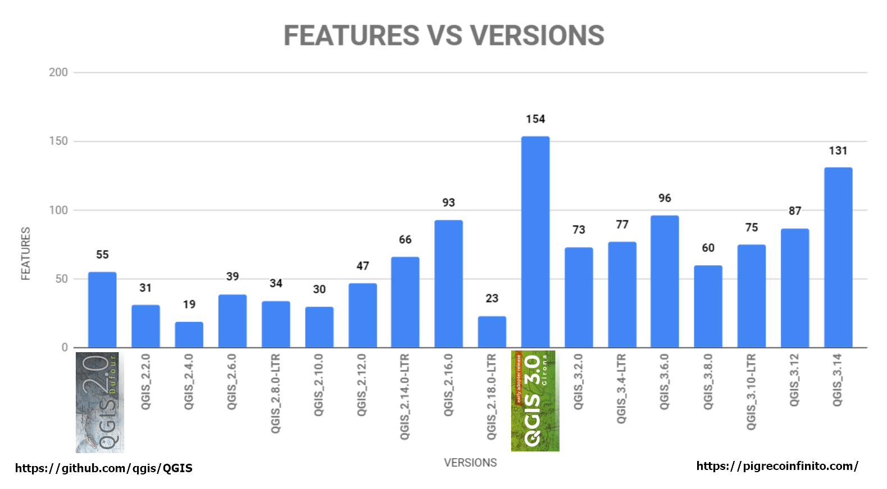

# Changelog 3.14 (Pi)

The following changelogs are the result of this [filter](https://github.com/qgis/QGIS/pulls?page=1&q=is%3Apr+is%3Aclosed+label%3Afeature+merged%3A2020-02-22T00%3A00%3A00Z..2020-05-15T12%3A00%3A00Z):

```
is:pr is:closed label:feature merged:2020-02-22T00:00:00Z..2020-05-15T12:00:00Z
```

- **Release date freeze** : 15 May,2020
- **Release date packaging**: 19 June, 2020
- **Release date**: 22 June, 2020

---

- **QGIS**: https://qgis.org/it/site/
- **Repository**: https://github.com/qgis/QGIS

---

- **Tweet QGIS 3.14 Pi**: https://twitter.com/totofiandaca/status/1244960239193120771


**---> UPDATED 2020-05-15 <---** **131 FEATURES**

[**All new features**](https://pigreco.github.io/changelog314/) <---

<!-- TOC -->

- [Statistics](#statistics)
  - [Authors](#authors)
- [Statistics](#statistics-1)
  - [Authors](#authors-1)
  - [Tags](#tags)
  - [Sponsors](#sponsors)
- [Map contest: mapping Pi for the 3.14 splash screen](#map-contest-mapping-pi-for-the-314-splash-screen)
- [file gimp](#file-gimp)
- [Graphics](#graphics)

<!-- /TOC -->

# Statistics

## Authors

# Statistics

## Authors

| Author | PR | Total_count | percent |
| --- | --- | --- | --- |
| nyalldawson | [36303](https://github.com/qgis/QGIS/pull/36303) [36300](https://github.com/qgis/QGIS/pull/36300) [36299](https://github.com/qgis/QGIS/pull/36299) [36245](https://github.com/qgis/QGIS/pull/36245) [36243](https://github.com/qgis/QGIS/pull/36243) [36224](https://github.com/qgis/QGIS/pull/36224) [36222](https://github.com/qgis/QGIS/pull/36222) [36162](https://github.com/qgis/QGIS/pull/36162) [36136](https://github.com/qgis/QGIS/pull/36136) [36106](https://github.com/qgis/QGIS/pull/36106) [36013](https://github.com/qgis/QGIS/pull/36013) [35974](https://github.com/qgis/QGIS/pull/35974) [35909](https://github.com/qgis/QGIS/pull/35909) [35863](https://github.com/qgis/QGIS/pull/35863) [35821](https://github.com/qgis/QGIS/pull/35821) [35808](https://github.com/qgis/QGIS/pull/35808) [35778](https://github.com/qgis/QGIS/pull/35778) [35760](https://github.com/qgis/QGIS/pull/35760) [35644](https://github.com/qgis/QGIS/pull/35644) [35641](https://github.com/qgis/QGIS/pull/35641) [35606](https://github.com/qgis/QGIS/pull/35606) [35591](https://github.com/qgis/QGIS/pull/35591) [35576](https://github.com/qgis/QGIS/pull/35576) [35518](https://github.com/qgis/QGIS/pull/35518) [35494](https://github.com/qgis/QGIS/pull/35494) [35484](https://github.com/qgis/QGIS/pull/35484) [35474](https://github.com/qgis/QGIS/pull/35474) [35473](https://github.com/qgis/QGIS/pull/35473) [35454](https://github.com/qgis/QGIS/pull/35454) [35452](https://github.com/qgis/QGIS/pull/35452) [35419](https://github.com/qgis/QGIS/pull/35419) [35396](https://github.com/qgis/QGIS/pull/35396) [35364](https://github.com/qgis/QGIS/pull/35364) [35324](https://github.com/qgis/QGIS/pull/35324) [35321](https://github.com/qgis/QGIS/pull/35321) [35319](https://github.com/qgis/QGIS/pull/35319) [35292](https://github.com/qgis/QGIS/pull/35292) [35251](https://github.com/qgis/QGIS/pull/35251) [35244](https://github.com/qgis/QGIS/pull/35244) [35238](https://github.com/qgis/QGIS/pull/35238) [35225](https://github.com/qgis/QGIS/pull/35225) [35208](https://github.com/qgis/QGIS/pull/35208) [35160](https://github.com/qgis/QGIS/pull/35160) [35130](https://github.com/qgis/QGIS/pull/35130) [35056](https://github.com/qgis/QGIS/pull/35056) [34987](https://github.com/qgis/QGIS/pull/34987) [34955](https://github.com/qgis/QGIS/pull/34955) [34938](https://github.com/qgis/QGIS/pull/34938) [34936](https://github.com/qgis/QGIS/pull/34936) [34898](https://github.com/qgis/QGIS/pull/34898) [34895](https://github.com/qgis/QGIS/pull/34895) [34856](https://github.com/qgis/QGIS/pull/34856) [34617](https://github.com/qgis/QGIS/pull/34617) [34610](https://github.com/qgis/QGIS/pull/34610) [36453](https://github.com/qgis/QGIS/pull/36453) [36367](https://github.com/qgis/QGIS/pull/36367) [36324](https://github.com/qgis/QGIS/pull/36324) [36283](https://github.com/qgis/QGIS/pull/36283)  | 58 | 44.27
| elpaso | [35738](https://github.com/qgis/QGIS/pull/35738) [35688](https://github.com/qgis/QGIS/pull/35688) [35511](https://github.com/qgis/QGIS/pull/35511) [35488](https://github.com/qgis/QGIS/pull/35488) [34968](https://github.com/qgis/QGIS/pull/34968) [34914](https://github.com/qgis/QGIS/pull/34914) [34871](https://github.com/qgis/QGIS/pull/34871) [34827](https://github.com/qgis/QGIS/pull/34827) [34760](https://github.com/qgis/QGIS/pull/34760) [34654](https://github.com/qgis/QGIS/pull/34654) | 10 | 7.63
| vcloarec | [36171](https://github.com/qgis/QGIS/pull/36171) [35926](https://github.com/qgis/QGIS/pull/35926) [35466](https://github.com/qgis/QGIS/pull/35466) [35264](https://github.com/qgis/QGIS/pull/35264) [35216](https://github.com/qgis/QGIS/pull/35216) [34945](https://github.com/qgis/QGIS/pull/34945) [34532](https://github.com/qgis/QGIS/pull/34532) [36334](https://github.com/qgis/QGIS/pull/36334) [36313](https://github.com/qgis/QGIS/pull/36313)| 9 | 6.87
| alexbruy | [36202](https://github.com/qgis/QGIS/pull/36202) [35901](https://github.com/qgis/QGIS/pull/35901) [35815](https://github.com/qgis/QGIS/pull/35815) [35790](https://github.com/qgis/QGIS/pull/35790) [35764](https://github.com/qgis/QGIS/pull/35764) [35076](https://github.com/qgis/QGIS/pull/35076) [36289](https://github.com/qgis/QGIS/pull/36289) [36258](https://github.com/qgis/QGIS/pull/36258)  | 8 | 6.10
| 3nids | [36236](https://github.com/qgis/QGIS/pull/36236) [36190](https://github.com/qgis/QGIS/pull/36190) [36166](https://github.com/qgis/QGIS/pull/36166) [36089](https://github.com/qgis/QGIS/pull/36089) [35382](https://github.com/qgis/QGIS/pull/35382) [36199](https://github.com/qgis/QGIS/pull/36199) | 6 | 4.58
| wonder-sk | [36099](https://github.com/qgis/QGIS/pull/36099) [35748](https://github.com/qgis/QGIS/pull/35748) [35657](https://github.com/qgis/QGIS/pull/35657) [35446](https://github.com/qgis/QGIS/pull/35446) [35341](https://github.com/qgis/QGIS/pull/35341) | 5 |
| nirvn | [35689](https://github.com/qgis/QGIS/pull/35689) [35475](https://github.com/qgis/QGIS/pull/35475) [35224](https://github.com/qgis/QGIS/pull/35224) [35197](https://github.com/qgis/QGIS/pull/35197) [36304](https://github.com/qgis/QGIS/pull/36304) | 5 |
| JanCaha | [36069](https://github.com/qgis/QGIS/pull/36069) [35928](https://github.com/qgis/QGIS/pull/35928) [35889](https://github.com/qgis/QGIS/pull/35889) [35839](https://github.com/qgis/QGIS/pull/35839) | 4 |
| Samweli | [34590](https://github.com/qgis/QGIS/pull/34590) [34497](https://github.com/qgis/QGIS/pull/34497) [34040](https://github.com/qgis/QGIS/pull/34040) [36309](https://github.com/qgis/QGIS/pull/36309)  | 4 |
| root676 | [36130](https://github.com/qgis/QGIS/pull/36130) [35727](https://github.com/qgis/QGIS/pull/35727) [35694](https://github.com/qgis/QGIS/pull/35694) | 3 |
| gacarrillor | [35933](https://github.com/qgis/QGIS/pull/35933) [35084](https://github.com/qgis/QGIS/pull/35084) [31387](https://github.com/qgis/QGIS/pull/31387) | 3 |
| uclaros | [35531](https://github.com/qgis/QGIS/pull/35531) [35097](https://github.com/qgis/QGIS/pull/35097) | 2 |
| suricactus | [35085](https://github.com/qgis/QGIS/pull/35085) [34997](https://github.com/qgis/QGIS/pull/34997)  | 2 |
| agiudiceandrea | [36131](https://github.com/qgis/QGIS/pull/36131) | 1 |
| jmonticolo | [35559](https://github.com/qgis/QGIS/pull/35559) | 1 |
| beketata | [35438](https://github.com/qgis/QGIS/pull/35438) | 1 |
| mhugent | [35408](https://github.com/qgis/QGIS/pull/35408) | 1 |
| Gustry | [35211](https://github.com/qgis/QGIS/pull/35211) | 1 |
| m-kuhn | [35035](https://github.com/qgis/QGIS/pull/35035) | 1 |
| olivierdalang | [34876](https://github.com/qgis/QGIS/pull/34876) | 1 |
| PeterPetrik | [34848](https://github.com/qgis/QGIS/pull/34848) | 1 |
| roya0045 | [34547](https://github.com/qgis/QGIS/pull/34547) | 1 |
| DelazJ | [33950](https://github.com/qgis/QGIS/pull/33950) | 1 |
| lbartoletti | [33622](https://github.com/qgis/QGIS/pull/33622) | 1 |
| troopa81 | [35112](https://github.com/qgis/QGIS/pull/35112) | 1 |

[↑ come back ↑](#features)

## Tags

tags|count|percent|histogram
----|-----|-------|------
Processing|29|21.01|**************************************************
Print Layouts|18|13.04|*******************************
-|12|8.70|********************
GUI/UX|12|8.70|********************
Expressions|11|7.97|******************
Temporal|10|7.25|*****************
Mesh|10|7.25|*****************
Forms|6|4.35|**********
Data Provider|5|3.62|********
API|4|2.90|******
Vector tiles|4|2.90|******
Symbology|4|2.90|******
Labeling|2|1.45|***
Server|2|1.45|***
Digitizing|2|1.45|***
Raster|2|1.45|***
Vectors|1|0.72|*
Documentation|1|0.72|*
Map and Legend|1|0.72|*
QGIS Browser|1|0.72|*
Plugins|1|0.72|*

[↑ come back ↑](#features)

## Sponsors

Sponsored by|count
---|--
SLYR|11
the QGIS Swiss user group|6
ARPA Piemonte|5
<https://www.lutraconsulting.co.uk/blog/2020/04/02/vectortiles-donors/>|4
Geoinformatikbüro Dassau GmbH|1
Fisel + König|1
Andreas Neumann|1
NaturalGIS|1
QField|1
Alta Ehf|1
the Swedish User Group|1
Qwat group / Ville de Lausanne ( [@ponceta](https://github.com/ponceta) [@dsavary](https://github.com/dsavary) ) / Oslandia and some spare time|1
geoProRegio AG ([www.geoproregio.ch](http://www.geoproregio.ch/))|1

[↑ come back ↑](#changelog-314-pi)

**stay tuned!**

---

**Useful references:**

- **VisiData** : https://www.visidata.org/
- **Miller** : https://github.com/johnkerl/miller
- **xq** : https://github.com/kislyuk/yq
- **Scrape** : https://github.com/aborruso/scrape-cli
- **curl** : https://curl.haxx.se/
- **Blog Pigrecoinfinito**: https://pigrecoinfinito.com/

---

**Thanks to the precious help of** [Andrea Borruso](https://twitter.com/aborruso)

# Map contest: mapping Pi for the 3.14 splash screen

https://lists.osgeo.org/pipermail/qgis-user/2020-May/045685.html


[↑ come back ↑](#changelog-314-pi)

# file gimp

<https://github.com/pigreco/changelog314/raw/master/imgs/splashscreen/splash314_v2.xcf>

# Graphics




[↑ come back ↑](#changelog-314-pi)